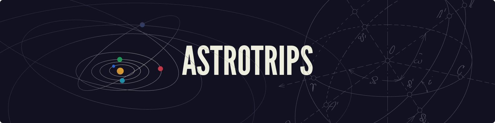
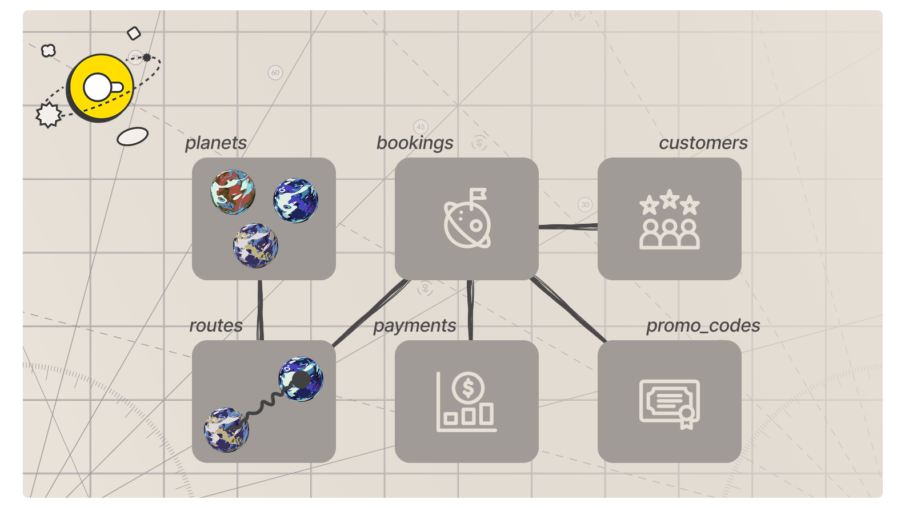

# Apache Airflow - AI Workshop

Welcome to the Apache Airflow AI workshop! You will build an AI-powered customer review intelligence pipeline using the [airflow-ai-sdk](https://github.com/astronomer/airflow-ai-sdk) and Apache Airflow 3.

**What you will learn:**

- Using LLMs for structured data extraction with `@task.llm`.
- LLM-powered branching with `@task.llm_branch` inside dynamic task groups.
- Generating text embeddings and computing similarity with `@task.embed`.
- Building multi-step AI agents with tools using `@task.agent`.
- Human-in-the-loop patterns for reviewing AI-generated content.
- Asset-aware scheduling for chaining Dags together.

## Prerequisites

- Access to the [Astro IDE](https://www.astronomer.io/product/ide/). _You don't need to set this up now. It is part of the exercise later._
- An **OpenAI API key** (or any OpenAI-compatible provider). _Required for LLM-based exercises._

## Scenario: AstroTrips

AstroTrips is a fictional travel company specializing in interplanetary trips. Customers can book journeys to destinations like the Moon, Mars, or Europa, complete with launch windows and passenger manifests.

As AstroTrips grows, customer reviews are piling up. The support team is overwhelmed and needs automation. Your job is to build an AI-powered pipeline that analyzes reviews, routes them to the right team, finds similar complaints, drafts personalized responses, and lets a human approve or reject each one, all orchestrated with Airflow.

Throughout this workshop, you will work as an AI engineer at AstroTrips. Your task is to build and extend Airflow Dags that process customer reviews using LLMs, embeddings, and agents, while focusing on best practices rather than domain complexity.



The underlying database used for AstroTrips is DuckDB, and it comes with a set of base tables and might be extended with additional tables depending on the workshop.



## Using MotherDuck (optional)

> [!CAUTION]
> This optional step can be skipped for regular workshop participation. It is intended for advanced exploration after the workshop.

This project is configured to use DuckDB with a local database file stored in `include/astrotrips.duckdb`. While this setup is sufficient for this scenario, it has specific limitations:

- **No concurrent access:** The database cannot be written to by multiple concurrent processes.
- **No distributed processing:** Because the database is a local file, all Airflow tasks must run on the same node to access it.

To run this code in a distributed setup or enable concurrent access, you can easily switch to [MotherDuck](https://motherduck.com), a managed cloud service for DuckDB.

1. Sign up for a free account at [motherduck.com](https://motherduck.com).
2. Once logged in, create a new attached database named `astrotrips`.
3. Go to **Settings** -> **Integrations** -> **Access Tokens**.
4. Click **Create token**, keep the default settings, and select **Create token** in the popup window.
5. Copy the generated token and update the connection details in your `.env` file as follows:

```
AIRFLOW_CONN_DUCKDB_ASTROTRIPS='{
    "conn_type":"duckdb",
    "host":"md:astrotrips?motherduck_token=<YOUR_MOTHERDUCK_TOKEN>"
}'
```

> **Note:** Ensure you also update any other references to the local DuckDB file path, such as `include/connections.yaml` if applicable.

## Using Astro CLI (optional)

> [!CAUTION]
> This optional step can be skipped for regular workshop participation. It is intended for advanced exploration after the workshop.

Workshops can also be worked on using the Astro CLI and a local, containerized Airflow setup. Copy `.env.dist` to `.env` and add your `OPENAI_API_KEY`, then adjust the configuration values if needed. You can start the project with `astro dev start`. However, these workshops are primarily designed for use with the Astro IDE.

## OpenAI API key

This workshop uses OpenAI-compatible models for LLM tasks. You will need an API key from [OpenAI](https://platform.openai.com/api-keys) or any compatible provider. The key is configured as an environment variable (`OPENAI_API_KEY`) during the setup exercise. Embeddings run locally via sentence-transformers and do not require an API key.

## Get started

Please proceed by following the exercises in [exercises.md](exercises.md).
