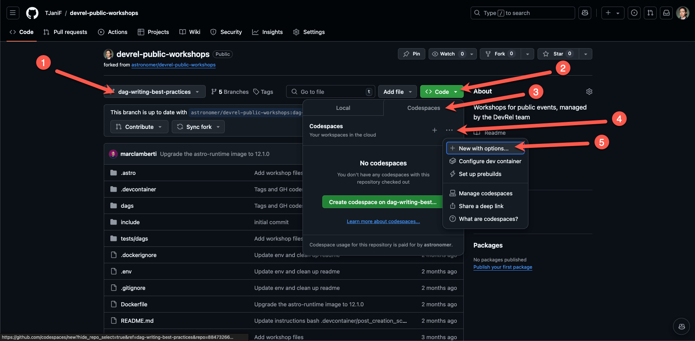
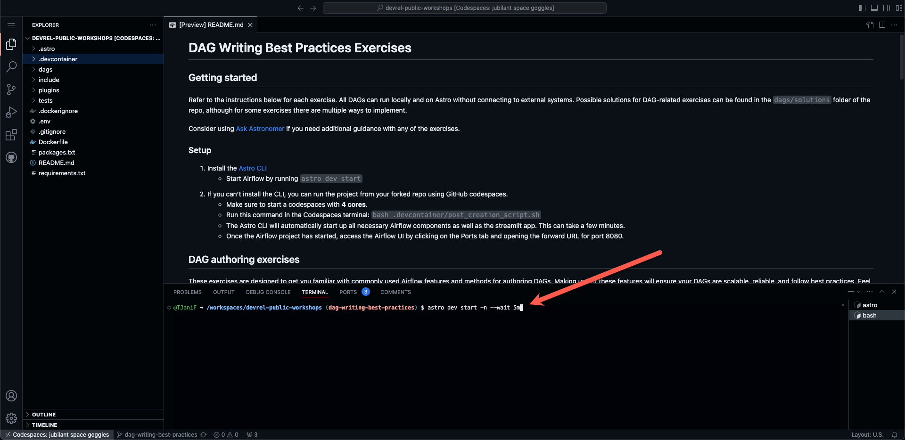

# GenAI with Airflow Workshop

Welcome! 🚀

Productionizing GenAI applications often relies on multi-stage, complex pipelines that manage data ingestion, creation of vector embeddings, vector storage, querying, and response construction. These pipelines need to run reliably, scale efficiently, and recover from failure without manual intervention. Apache Airflow, a leading open-source orchestration framework, provides the structure and flexibility required to operationalize GenAI workloads with production-grade reliability. 

In this workshop, you'll learn the basics of using Airflow to build and orchestrate end-to-end GenAI workflows. 


## Introduction

This workshop explores using Airflow to orchestrate GenAI workflows through the lens of a Retrieval-Augmented Generation (RAG) use case: a book recommendation system that embeds book descriptions, loads them into a vector database, queries them based on user input, and provides LLM-generated summaries. You’ll learn how to implement this process with Airflow Dags, and make use of foundational orchestration features like scheduling, task dependency management, and parallel execution. You will also learn how to use the [Airflow AI SDK](https://github.com/astronomer/airflow-ai-sdk) to easily interact with large language models from your pipelines. 

Set up your environment by following the instructions in the [Setup](#setup) section below. All Dags in this repository can be run locally using open source tools, including Airflow and Weaviate. There are also optional exercises that require an OpenAI API key.

Sample solutions for Dag-writing related exercises can be found in the [`solutions/`](/solutions/) folder of the repo.

### Setup

To set up a local Airflow environment you have two options, you can either use the Astro CLI or GitHub Codespaces.

#### Option 1: Astro CLI

1. Make sure you have [Docker](https://docs.docker.com/get-docker/) or Podman installed and running on your machine.
2. Install the free [Astro CLI](https://www.astronomer.io/docs/astro/cli/install-cli).
3. Fork this repository and clone it to your local machine. Make sure you uncheck the `Copy the main branch only` option when forking.

   

4. Clone the repository and run `git checkout genai-with-airflow` to switch to the correct branch.
5. Create a new file called `.env` in the root directory. Copy the contents of the `.env_example` file into `.env`. If you have an OpenAI API key, replace `<your-openai-api-key>` with it. Save the file.
6. Run `astro dev start` in the root of the cloned repository to start the Airflow environment.
7. Access the Airflow UI at `localhost:8080` in your browser. Log in using `admin` as both the username and password.

#### Option 2: GitHub Codespaces

If you can't install the CLI, you can run the project from your forked repo using GitHub Codespaces.

1. Fork this repository. Make sure you uncheck the `Copy the main branch only` option when forking.

   

2. Make sure you are on the `genai-with-airflow` branch.
3. Create a new file called `.env` in the root directory. Copy the contents of the `.env_example` file into `.env`. If you have an OpenAI API key, replace `<your-openai-api-key>` with it. Save the file.
4. Click on the green "Code" button and select the "Codespaces" tab. 
5. Click on the 3 dots and then `+ New with options...` to create a new Codespace with a configuration, make sure to select a Machine type of at least `4-core`.

   

6. Run `astro dev start -n --wait 5m` in the Codespaces terminal to start the Airflow environment using the Astro CLI. This can take a few minutes.

   

   Once you see the following printed to your terminal, the Airflow environment is ready to use:

   ```text
   ✔ Project image has been updated
   ✔ Project started
   ➤ Airflow UI: http://localhost:8080
   ➤ Postgres Database: postgresql://localhost:5435/postgres
   ➤ The default Postgres DB credentials are: postgres:postgres
   ```

7. Once the Airflow project has started, access the Airflow UI by clicking on the Ports tab and opening the forward URL for port `8080`.

> [!TIP]
> If when accessing the forward URL you get an error like `{"detail":"Invalid or unsafe next URL"}`, you will need to modify the forwarded URL. Delete everything forward of `next=....` (this should be after `/login?`, ). The URL will update, adn then remove `:8080`, so your URL should endd in `.app.github.dev`

8. Log into the Airflow UI using `admin` as both the username and password. It is possible that after logging in you see an error, in this case you have to open the URL again from the ports tab.

# Exercises

After you have Airflow running locally, complete these exercises to get more familiar with how to turn GenAI prototypes into production-ready pipelines.

## Exercise 1: Explore the Airflow UI


## Exercise 2: Run the RAG pipeline


## Exercise 3: Review features for running in production


## (Optional) Exercise 4: Add an LLM task

> [!Note]
> This task requires an OpenAI API Key. If you don't have one, it's okay to skip this exercise.