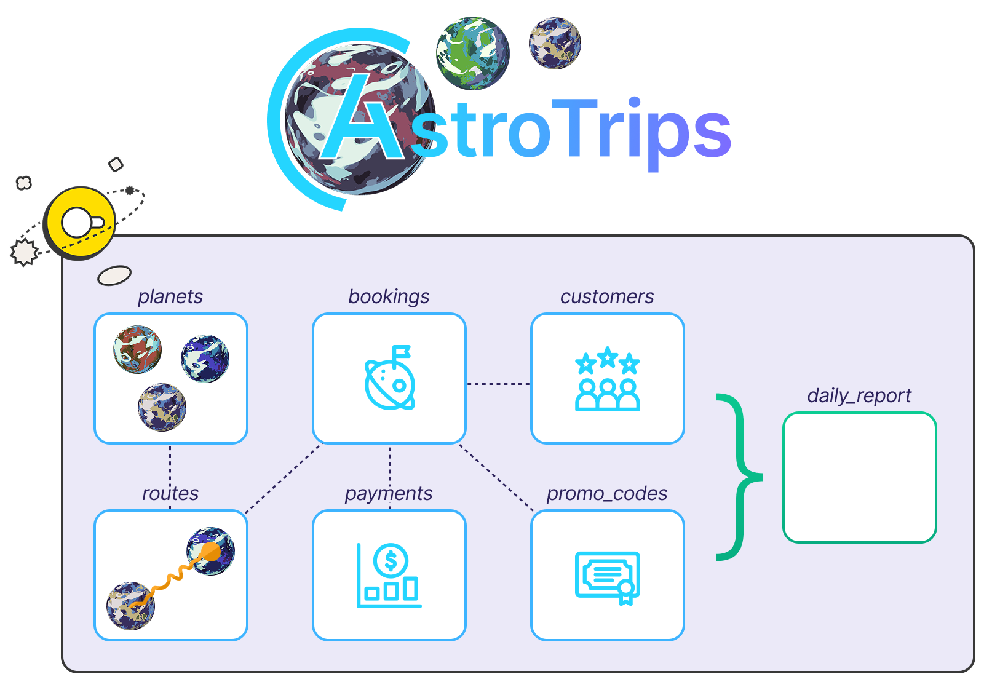

# Apache Airflow - ELT/ETL Workshop

Welcome to the Apache Airflow ELT/ETL workshop! You will build and orchestrate data pipelines in a real Airflow environment using a practical scenario.

**What you will learn:**

- Authoring data pipelines with parameterized SQL queries.
- Use a combination of TaskFlow API and classic operators for orchestration.
- Asset-aware scheduling for data dependencies.
- Dynamic task mapping for scalable data processing.
- Data quality checks as part of your pipeline.
- Human-in-the-loop patterns for manual intervention.

## Prerequisites

- Access to the [Astro IDE](https://www.astronomer.io/product/ide/).

## Scenario: AstroTrips

AstroTrips is a fictional travel company specializing in interplanetary trips. Customers can book journeys to destinations like Mars, Venus, or Saturn, complete with launch windows, spacecraft assignments, and premium add-ons.

As AstroTrips grows, so does the amount of data it generates: bookings, customers, destinations, prices, and operational metrics. To support analytics and reporting, the company relies on Apache Airflow to orchestrate data pipelines that ingest, transform, and validate this data.

Throughout this workshop, you will work as a data engineer at AstroTrips. Your task is to build and extend Airflow Dags that process AstroTrips data, using realistic datasets and workflows while focusing on best practices rather than domain complexity.



The underlying database used for AstroTips is DuckDB and it comes with a set of base tables and might be extended with additional tables depending on the workshop.

## Using MotherDuck (optional)

> [!CAUTION]
> This optional step can be skipped for regular workshop participation. It is intended for advanced exploration after the workshop.

This project is configured to use DuckDB with a local database file stored in `include/astrotrips.duckdb`. While this setup is sufficient for this scenario, it has specific limitations:

- **No concurrent access:** The database cannot be written to by multiple concurrent processes.
- **No distributed processing:** Because the database is a local file, all Airflow tasks must run on the same node to access it. This works reliably with the Astro CLI local environment (which uses the `LocalExecutor` to spawn worker subprocesses within the scheduler container) or a single-worker setup. However, it will fail in a distributed environment with multiple distinct worker nodes.

To run this code in a distributed setup or enable concurrent access, you can easily switch to [MotherDuck](https://motherduck.com), a managed cloud service for DuckDB.

1. Sign up for a free account at [motherduck.com](https://motherduck.com).
2. Once logged in, create a new attached database named `astrotrips`.
3. Go to **Settings** -> **Integrations** -> **Access Tokens**.
4. Click **Create token**, keep the default settings, and select **Create token** in the popup window.
5. Copy the generated token and update the connection details in your `.env` file as follows:

```
AIRFLOW_CONN_DUCKDB_ASTROTRIPS='{
    "conn_type":"duckdb",
    "host":"md:astrotrips?motherduck_token=<YOUR_MOTHERDUCK_TOKEN>"
}'
```

> **Note:** Ensure you also update any other references to the local DuckDB file path, such as `include/connections.yaml` if applicable.

## Using Astro CLI (optional)

> [!CAUTION]
> This optional step can be skipped for regular workshop participation. It is intended for advanced exploration after the workshop.

Workshops can also be worked on using the Astro CLI and a local, containerized Airflow setup. Copy `.env.dist` to `.env`, then adjust the configuration values if needed. You can start the project with `astro dev start`. However, these workshops are primarily designed for use with the Astro IDE.

## Get started

Please proceed by following the exercises in [exercises.md](exercises.md).
