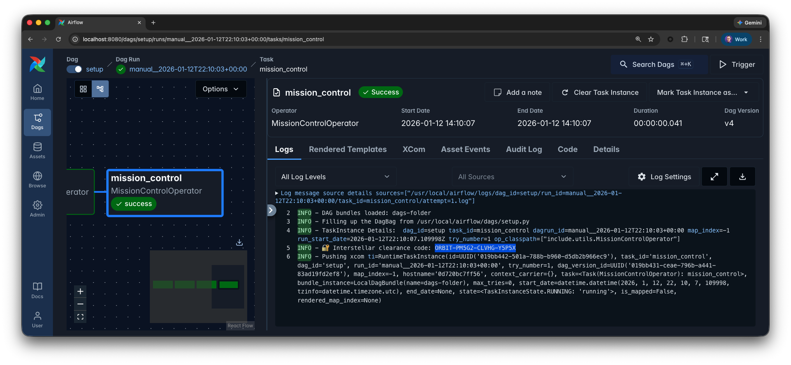

# Workshop base

## Prerequisites

- Copy `.env.dist` to `.env`.
- Access to the [Astro IDE](https://www.astronomer.io/product/ide/).

## Scenario: AstroTrips

AstroTrips is a fictional travel company specializing in interplanetary trips. Customers can book journeys to destinations like Mars, Venus, or Saturn, complete with launch windows, spacecraft assignments, and premium add-ons.

As AstroTrips grows, so does the amount of data it generates: bookings, customers, destinations, prices, and operational metrics. To support analytics and reporting, the company relies on Apache Airflow to orchestrate data pipelines that ingest, transform, and validate this data.

Throughout this workshop, you will work as a data engineer at AstroTrips. Your task is to build and extend Airflow Dags that process AstroTrips data, using realistic datasets and workflows while focusing on best practices rather than domain complexity.


The underlying database used for AstroTips is DuckDB and it comes with a set of base tables and might be extended with additional tables depending on the workshop.

## Using MotherDuck (optional)

This project is configured to use DuckDB with a local database file stored in `include/astrotrips.duckdb`. While this setup is sufficient for this scenario, it has specific limitations:

- **No concurrent access:** The database cannot be written to by multiple concurrent processes.
- **No distributed processing:** Because the database is a local file, all Airflow tasks must run on the same node to access it. This works reliably with the Astro CLI local environment (which uses the `LocalExecutor` to spawn worker subprocesses within the scheduler container) or a single-worker setup. However, it will fail in a distributed environment with multiple distinct worker nodes.

To run this code in a distributed setup or enable concurrent access, you can easily switch to [MotherDuck](https://motherduck.com), a managed cloud service for DuckDB.

1. Sign up for a free account at [motherduck.com](https://motherduck.com).
2. Once logged in, create a new attached database named `astrotrips`.
3. Go to **Settings** -> **Integrations** -> **Access Tokens**.
4. Click **Create token**, keep the default settings, and select **Create token** in the popup window.
5. Copy the generated token and update the connection details in your `.env` file as follows:

```
AIRFLOW_CONN_DUCKDB_ASTROTRIPS='{
    "conn_type":"duckdb",
    "host":"md:astrotrips?motherduck_token=<YOUR_MOTHERDUCK_TOKEN>"
}'
```

> **Note:** Ensure you also update any other references to the local DuckDB file path, such as `include/connections.yaml` if applicable.

## Workshop repo structure

_todo: this section belongs to `main` but while this new base in development, it is kept here._

This repository uses branches to represent individual workshops.

New workshops follow a structured naming scheme:
```
workshops/<scenario>/<workshop-name>
```

Using slash-separated branch names allows many tools (for example GitHub, GitLab, and IDE integrations) to render branches in a tree-like structure, making related workshops easier to discover and navigate.

Each scenario has a base branch:
```
workshops/<scenario>/_base
```

which contains all shared components for the scenario, such as:
- scenario description and context
- shared utilities
- setup DAGs and helper functions
- reusable operators

**This branch is not a runnable workshop on its own. It serves as a template and foundation for all scenario-based workshops.**

Individual workshops are created as separate branches derived from `_base`, for example:
```
workshops/astrotrips/etl
```

These branches extend the base scenario with workshop-specific components, Dags, exercises, and instructions.

## Gamification

The base project comes with a custom `MissionControlOperator` ([include/utils.py](include/utils.py)).

If gamification is required (for example to hand out swag during a workshop), an additional exercise can be added at the very end. In this exercise, participants are asked to add the `MissionControlOperator` as the final task in their Dag. If multiple Dags are part of the workshop, just select one specific of them.

When the Dag is executed successfully, this task will emit a clearance code in the task logs, for example:
```
🔐 Interstellar clearance code: ORBIT-PM5G2-CLVHG-TT64U
```

The clearance code consists of four parts:
```
<prefix>-<types_hash>-<edges_hash>-<names_hash>
```
- `types_hash` is derived from the operator types used in the Dag
- `edges_hash` is derived from how tasks are connected
- `names_hash` is derived from the task IDs

Before the workshop, the host runs the same operator as part of the solution Dag to obtain the reference clearance code. Solutions and codes can be kept in an Astronomer interal repo if required.

Once participants have their code, they can submit it to the host (in person or via chat, depending on the workshop setup). The host can then compare it with the reference code from the solution.

If participants implemented the correct Dag structure but used different task IDs, only the last part of the code will differ, for example:
```
Solution:           ORBIT-PM5G2-CLVHG-Y5P5X
Different task IDs: ORBIT-PM5G2-CLVHG-TT64U
```

This allows the host to quickly assess how close a solution is to the intended outcome and decide whether the code is still acceptable.

Since the clearance code is derived from the Dag structure and requires the workshop solution to be executed, it is difficult to fake and therefore provides a lightweight but effective form of cheat resistance without an external dependency.



## README and exercises

For each workshop:
- remove unnecessary parts of this `README` to focus on the scenario introduction.
- fill out the [exercises.md](exercises.md) to have a document fully focused on the actionable workshop exercises.
