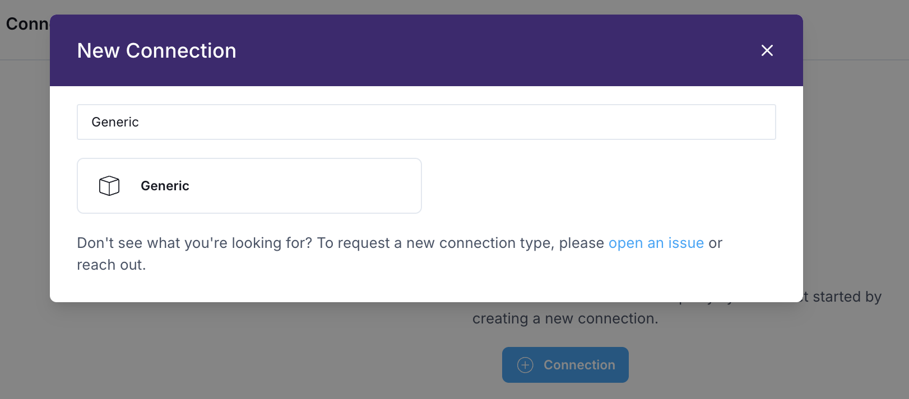
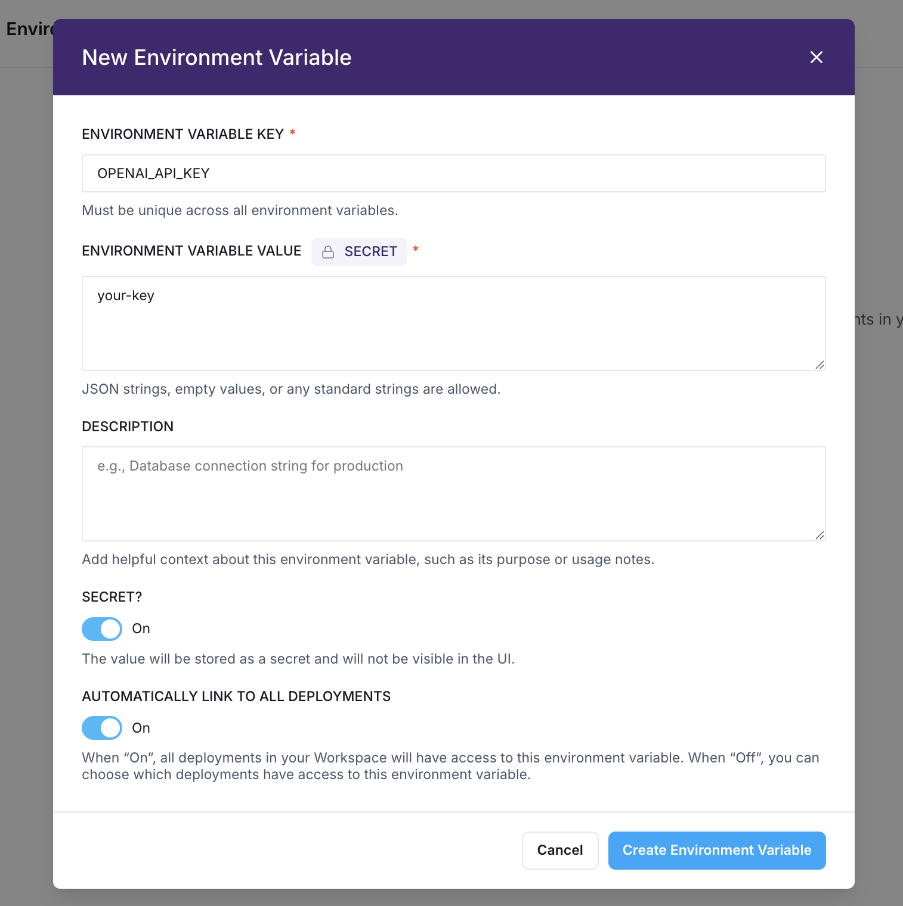
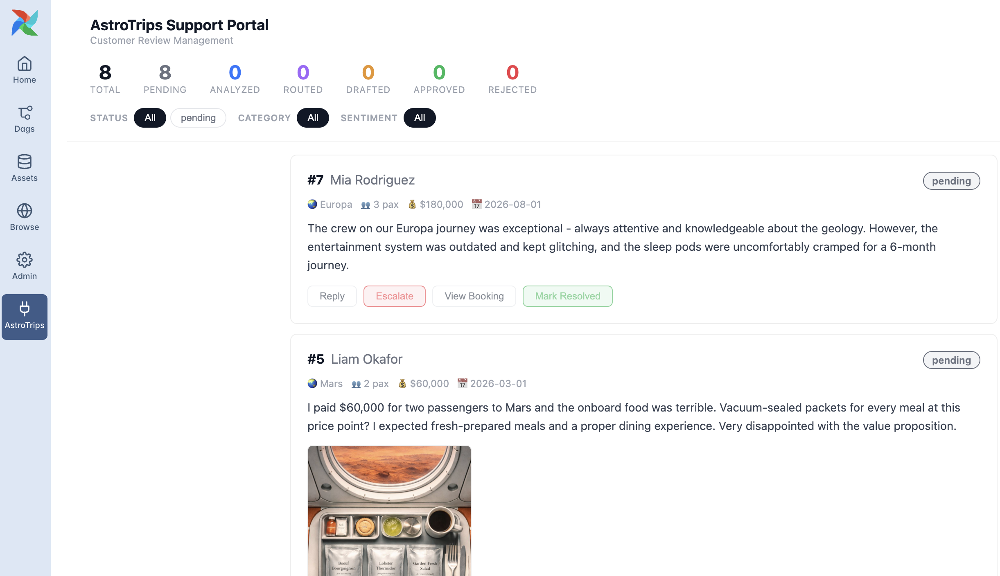
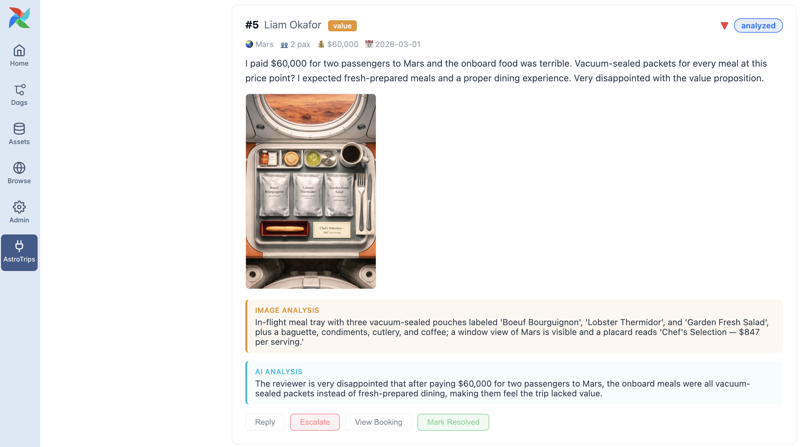
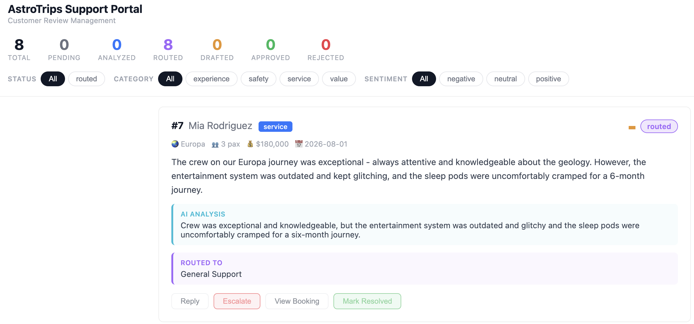
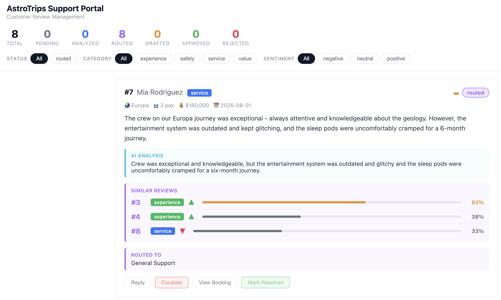
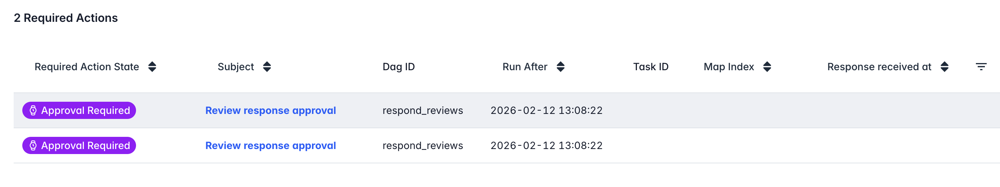
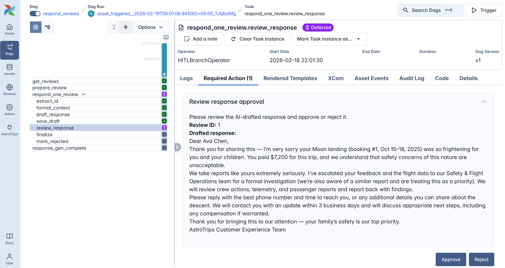
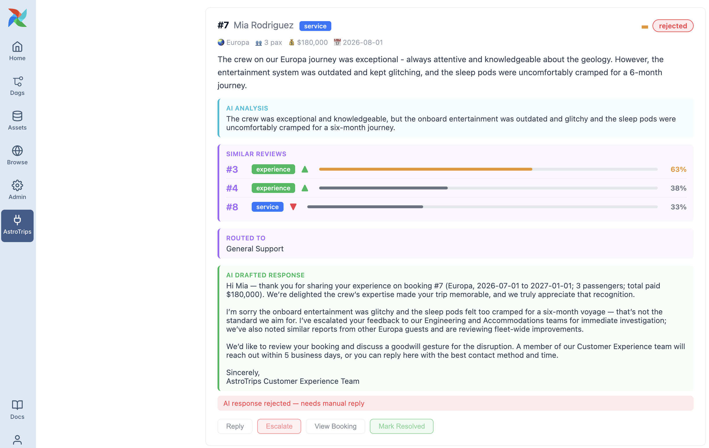

# Airflow AI Workshop

## Exercises

- [Exercise 0: Astro and Astro IDE](#exercise-0-astro-and-astro-ide)
- [Exercise 1: Analyze reviews with an LLM](#exercise-1-analyze-reviews-with-an-llm)
- [Exercise 2: Route reviews with LLM branching](#exercise-2-route-reviews-with-llm-branching)
- [Challenge: Mission control](#challenge-mission-control)
- [Exercise 3: Embed reviews and find similar complaints](#exercise-3-embed-reviews-and-find-similar-complaints)
- [Exercise 4: AI agent with human-in-the-loop](#exercise-4-ai-agent-with-human-in-the-loop)

---

# Exercise 0: Astro and Astro IDE

## Set Up Astro IDE

This workshop does not require any local Airflow installation. Instead, all development takes place within Astro and the Astro IDE. The first step is to set up a **free** Astro trial to run Airflow and access the Astro IDE for Dag development.

While a deep understanding of the Astro platform is not required, here is a quick overview: Each customer has a dedicated Organization on Astro. An Organization can contain multiple Workspaces (for example, one per team). Each Workspace can have multiple Deployments, where a Deployment is a fully hosted Airflow environment.

1. Create a [free trial of Astro](https://www.astronomer.io/lp/signup/?utm_source=conference&utm_medium=web&utm_campaign=devrel-workshop).

    - After creating an account, verifying your email, and logging in, choose _Personal_ in the first step.
    - Next, choose an _Organization_ and _Workspace_ name. These can be fictional names and you can change them later.
    - In the third step, click the small link at the bottom under the two boxes: _Or skip this and go to your workspace_.

    

    - You should now see the Astro platform UI.

2. Open the _Astro IDE_ from the left navigation and select _Connect Git project..._
3. Under _Select a Git provider for manual configuration_, select _GitHub_ and enter the following details:

    - **ACCOUNT**: `astronomer`
    - **REPOSITORY**: `devrel-public-workshops`
    - _Keep Astro Project Path empty_
    - **BRANCH**: `workshops/astrotrips/ai`
    - **AUTHENTICATION TYPE**: `None (public repository)`
    - Click _Connect_. The IDE will import and open the project for you.

    

**You now have the Astro IDE with the project ready to go.**


> [!TIP]
> The Astro IDE comes with an integrated AI assistant, optimized for workflow orchestration with Apache Airflow. Feel free to interact with it during this workshop to learn more about certain concepts.

## Set Up the Connection

This workshop relies on a DuckDB database. To ensure your test environments can connect to it, the next step is to create a workspace-wide connection.

> [!NOTE]
> The next two steps take place in the main Astro platform UI, not inside the Astro IDE. If you collapsed the sidebar, expand it to navigate.

1. In Astro, navigate to _Environment_ → _Connections_ and click the _+ Connection_ button.
2. In the dialog, search for and select _Generic_, then enter the following details:

    

    - **CONNECTION ID**: `duckdb_astrotrips`
    - **TYPE**: `duckdb`
    - **HOST**: `include/astrotrips.duckdb`
    - Set **AUTOMATICALLY LINK TO ALL DEPLOYMENTS** to _On_

    

3. Click _Create Connection_.

> [!TIP]
> Learn more about [Airflow connections](https://www.astronomer.io/docs/learn/connections).

## Add the OpenAI API key

The AI exercises require an OpenAI API key (or any compatible provider). We will set this as an environment variable, to make it available for our Airflow instance.

1. In Astro, navigate to _Environment_ → _Environment Variables_ and click the _+ Environment Variable_ button.
2. Enter the following details:
    - **KEY**: `OPENAI_API_KEY`
    - **VALUE**: your API key
    - Mark it as **Secret**
    - Set **AUTOMATICALLY LINK TO ALL DEPLOYMENTS** to _On_

    

3. Click _Create Environment Variable_.

## Start the test deployment and run the setup Dag

The final setup step is to start a test deployment (a fully functional Airflow environment) and run the `setup` Dag, which creates the DuckDB database with tables and sample data for the following exercises.

> [!CAUTION]
> Do not close the Astro IDE browser tab during the workshop. Always use this tab to return to the Astro IDE instead of reopening it to preserve your session. If you close it, you will need to create a new test deployment.

1. Navigate to the _Astro IDE_ and click _Start Test Deployment_ in the top right corner. The deployment takes 3-5 minutes to spin up.
2. While the deployment is starting, click the dropdown next to _Sync to Test_ and select _Test Deployment Details_.

    

3. Navigate to the _Environment_ tab and click _Edit Deployment Variables_.
4. In the popup, remove the `AIRFLOW__SCHEDULER__USE_JOB_SCHEDULE` variable to enable scheduling for the test deployment.
5. Click _Update Environment Variables_.

    

> [!NOTE]
> Scheduling is disabled by default for test deployments to prevent Dags from running automatically. This gives you maximum control during development and helps avoid unwanted side effects. However, for this workshop, we want Dags to be scheduled based on asset updates, so we enable scheduling accordingly.

6. Back in the Astro IDE, once the test deployment is ready, select _Open Airflow_, from the same dropdown menu.

    

7. In the Airflow UI, open the Dags view from the left menu and trigger the `setup` Dag using the play button.

    

**Once the Dag run completes successfully, your database is ready.**

> [!IMPORTANT]
> Running this Dag resets and re-creates the database. If you encounter any issues in the following exercises, simply run this Dag again.

## AstroTrips support portal

Before we start coding, take a look at the **AstroTrips Support Portal**. In the Airflow sidebar, click the _AstroTrips_ link to open it.



This is a custom **Airflow plugin** built with FastAPI, one of the new extension points in Airflow 3. It provides a dashboard that visualizes the state of all customer reviews as they move through the pipeline.

Right now, all 8 reviews show as _pending_. As you work through the exercises, you will see reviews progress through analysis, routing, response drafting, and approval, all reflected on this dashboard.

This is not only a feedback mechanism that gives you something visual to review after each exercise, but also a great example of how Airflow's potential use cases have evolved with new features.

> [!NOTE]
> Building plugins is not part of this workshop. The portal is pre-built to support the exercises and give you a visual overview of your progress. If you're curious about the implementation, explore `plugins/support_portal.py` after the workshop.

> [!CAUTION]
> You will also see a `plugin_sync` Dag in the Airflow UI. This Dag keeps the support portal data in sync and triggers automatically whenever a pipeline Dag completes. **Leave it activated and do not modify it.**

> [!TIP]
> Learn more about [Airflow plugins](https://www.astronomer.io/docs/learn/using-airflow-plugins).

---

# Exercise 1: Analyze reviews with an LLM

In this exercise, you will build a Dag that uses an LLM to analyze customer reviews. The LLM extracts structured data (_sentiment, category, and a summary_) from each review. Some reviews include photos, so the Dag also uses vision capabilities to describe what the image shows.

**What you will learn:**

- Calling an LLM with `@task.llm` and getting structured output via a Pydantic model.
- Sending images to a vision-capable LLM with `BinaryContent`.
- Using `.expand_kwargs()` to dynamically map over multiple arguments.
- Publishing an asset to trigger downstream Dags.

## Create the Dag file

1. In the Astro IDE, create a new file `dags/analyze_reviews.py`.
2. Add the following imports and constants:

    ```python
    import airflow_ai_sdk as ai_sdk
    import os
    from pendulum import duration
    from airflow.configuration import AIRFLOW_HOME
    from airflow.providers.common.sql.operators.sql import (
        SQLExecuteQueryOperator,
        SQLInsertRowsOperator,
    )
    from airflow.sdk import Asset, chain, dag, task
    from pydantic_ai import BinaryContent
    from typing import Literal

    _DUCKDB_CONN_ID = "duckdb_astrotrips"
    ```

3. Define the Dag:

    ```python
    @dag(
        tags=["astrotrips", "ai", "reviews"],
        template_searchpath=f"{AIRFLOW_HOME}/include/sql",
        default_args={"retries": 3, "retry_delay": duration(seconds=10)},
    )
    def analyze_reviews():
        pass

    analyze_reviews()
    ```

> [!NOTE]
> This Dag has no `schedule` — it is triggered manually. The `default_args` add retry logic since DuckDB can throw temporary lock errors when multiple tasks write concurrently.

> [!NOTE]
> `pass` is a null operation that acts as a placeholder when a statement is syntactically required but no action needs to run. We use it as a temporary placeholder for Dag or task implementations, which we will complete step by step during the workshop exercises.

## Define the output model

The LLM should return structured data, not free text.

1. Define a Pydantic model **above** the `@dag` function that describes the expected output:

    ```python
    class ReviewAnalysis(ai_sdk.BaseModel):
        sentiment: Literal["positive", "negative", "neutral"]
        category: Literal["safety", "service", "value", "experience"]
        summary: str
        image_description: str | None = None
    ```

The `airflow-ai-sdk` provides its own `BaseModel` that auto-serializes results for XCom. Using `Literal` types constrains the LLM to only return valid values.

## Add the query and formatting tasks

1. Inside the Dag function (`analyze_reviews()`) function, add a `SQLExecuteQueryOperator` to run a query, which fetches all pending reviews:

    ```python
    _reviews = SQLExecuteQueryOperator(
        task_id="get_reviews",
        conn_id=_DUCKDB_CONN_ID,
        sql=(
            "SELECT review_id, booking_id, review_text, image_path, "
            "CAST(submitted_at AS VARCHAR) AS submitted_at "
            "FROM trip_reviews WHERE status = 'pending'"
        ),
    )
    ```

2. Add a task to format the query results into the shape expected by the LLM task:

    ```python
    @task
    def format_context(query_result):
        return [
            {"review_text": row[2], "image_path": row[3]}
            for row in query_result
        ]

    _formatted_context = format_context(_reviews.output)
    ```

> [!NOTE]
> When passing the result of a `SQLExecuteQueryOperator` to a `@task` function, you must use `.output` to get the XCom value. This is one way of passing data between classic operators and TaskFlow API based tasks.

## Add the LLM analysis task

This is the core of the exercise. The `@task.llm` decorator turns a regular Python function into an LLM-powered task.

1. Add the LLM task:

    ```python
    @task.llm(
        model="gpt-5-mini",
        system_prompt=(
            "You are a customer review analyst for AstroTrips, an interplanetary travel company. "
            "Analyze the given trip review and extract:\n"
            "- sentiment: positive, negative, or neutral\n"
            "- category: the primary category of the review:\n"
            "  - safety: concerns about travel safety, turbulence, landings, equipment\n"
            "  - service: crew/staff quality, communication, onboard experience\n"
            "  - value: pricing, billing, value-for-money complaints\n"
            "  - experience: the trip itself, destinations, sightseeing, overall enjoyment\n"
            "- summary: a single concise sentence summarizing the review\n"
            "- image_description: if an image is attached, describe what it shows in 1-2 sentences. "
            "If no image is attached, set this to null."
        ),
        output_type=ReviewAnalysis,
        max_active_tis_per_dagrun=1
    )
    def analyze_review(review_text: str, image_path: str | None = None) -> str | list:
        if image_path:
            full_path = os.path.join(AIRFLOW_HOME, "include", image_path)
            with open(full_path, "rb") as f:
                image_data = f.read()
            return [review_text, BinaryContent(data=image_data, media_type="image/jpeg")]
        return review_text
    ```

    The function body is a **translation function**, it returns the prompt that gets sent to the LLM. When an image is present, it returns a list with both the text and the image data. The LLM receives both and can describe what it sees. Take note how the system prompt is defined as an argument of the decorator.

2. Next, we analyze each review individually, along with its image (_if present_). The number of task instances is determined at runtime. To create parallel task instances at runtime, we use a feature called dynamic task mapping. We do this by calling `expand` on a task, or in this case, `expand_kwargs` to pass multiple arguments:

    ```python
    _analyses = analyze_review.expand_kwargs(_formatted_context)
    ```

> [!NOTE]
> We use `.expand_kwargs()` instead of `.expand()` here because each review needs **two** arguments (`review_text` and `image_path`). With `.expand()`, passing two keyword arguments would create a cross product of all combinations. The `expand_kwargs()` method maps them as pairs.

> [!NOTE]
> We can limit parallelism using `max_active_tis_per_dagrun`. In this case, we process each review one at a time to keep the load on our test deployment as low as possible.

> [!TIP]
> Learn more about the [airflow-ai-sdk](https://github.com/astronomer/airflow-ai-sdk) and [dynamic task mapping](https://www.astronomer.io/docs/learn/dynamic-tasks).

## Add the save task

The LLM results need to be written back to the database. We'll collect all analyses together with the original review data and insert them using a delete-then-insert pattern.

1. Add a task to combine the original query data with the LLM output:

    ```python
    @task
    def prepare_rows(query_result, analyses):
        rows = []
        for row, analysis in zip(query_result, analyses):
            review_id, booking_id, review_text, image_path, submitted_at = row
            rows.append((
                review_id,
                booking_id,
                review_text,
                image_path,
                submitted_at,
                "analyzed",
                analysis["sentiment"],
                analysis["category"],
                analysis["summary"],
                analysis.get("image_description"),
            ))
        return rows

    _prepared_rows = prepare_rows(_reviews.output, _analyses)
    ```

2. Add the `SQLInsertRowsOperator` to save the results. The `outlets` parameter declares that this task updates the `analyzed-reviews` asset, which will trigger downstream Dags:

    ```python
    _save_analysis = SQLInsertRowsOperator(
        task_id="save_analyses",
        conn_id=_DUCKDB_CONN_ID,
        table_name="trip_reviews",
        rows=_prepared_rows,
        columns=[
            "review_id", "booking_id", "review_text", "image_path", "submitted_at",
            "status", "sentiment", "category", "summary", "image_analysis",
        ],
        preoperator="DELETE FROM trip_reviews WHERE status = 'pending'",
        outlets=[Asset("analyzed-reviews")],
    )
    ```

3. Wire it up:

    ```python
    chain(_prepared_rows, _save_analysis)
    ```

## Test your Dag

1. Sync your changes to the test deployment by clicking _Sync to Test_ within the Astro IDE.

> [!TIP]
> **Sync tips:**
> - Changes to Dag files sync fast. Changes to files in `include/` trigger an image rebuild, which takes longer.
> - While waiting for a sync, you can ask the Astro IDE AI questions about your Dag or about Airflow.
> - You don't need to commit your changes. If you want to keep your code after the workshop, fork the repository first.

2. Trigger the `analyze_reviews` Dag.
3. Once complete, open the **AstroTrips Support Portal**. You should see all 8 reviews with AI analysis results (sentiment, category, summary) and image descriptions for the 3 reviews that have photos.



---

# Exercise 2: Route reviews with LLM branching

In this exercise, you will build a Dag that routes each analyzed review to the right support team using LLM-powered branching. The LLM reads each review and decides which downstream task to run.

**What you will learn:**

- Using `@task.llm_branch` for LLM-powered Dag branching.
- Combining branching with `@task_group` and `.expand()` for per-item routing.
- Asset-aware scheduling to trigger this Dag automatically.

## Create the Dag file

1. Create `dags/route_reviews.py` with the following imports:

    ```python
    import pendulum
    from airflow.configuration import AIRFLOW_HOME
    from airflow.providers.common.sql.operators.sql import SQLExecuteQueryOperator
    from airflow.sdk import Asset, dag, task, task_group, chain

    _DUCKDB_CONN_ID = "duckdb_astrotrips"
    ```

2. Define the Dag with **asset-aware scheduling**. This Dag should trigger automatically whenever the `analyzed-reviews` asset is updated:

    ```python
    @dag(
        schedule=Asset("analyzed-reviews"),
        tags=["astrotrips", "ai", "reviews"],
        template_searchpath=f"{AIRFLOW_HOME}/include/sql",
        default_args={"retries": 3, "retry_delay": pendulum.duration(seconds=10)},
    )
    def route_reviews():
        pass

    route_reviews()
    ```

> [!TIP]
> Learn more about [asset-aware scheduling](https://www.astronomer.io/docs/learn/airflow-datasets).

## Add the query and formatting tasks

1. Inside the `route_reviews()` function, fetch all analyzed reviews and format them:

    ```python
    _reviews = SQLExecuteQueryOperator(
        task_id="get_reviews",
        conn_id=_DUCKDB_CONN_ID,
        sql=(
            "SELECT review_id, review_text, sentiment, category, summary "
            "FROM trip_reviews WHERE status = 'analyzed' "
            "ORDER BY submitted_at ASC"
        ),
    )

    @task
    def prepare_review_list(query_result):
        if not query_result:
            return []
        return [
            {
                "review_id": row[0],
                "text": row[1],
                "sentiment": row[2],
                "category": row[3],
                "summary": row[4],
            }
            for row in query_result
        ]

    _review_list = prepare_review_list(_reviews.output)
    ```

## Build the routing task group

Dynamic task mapping lets you create parallel instances of an atomic task at runtime. But what if a single task is not enough? You can also apply this feature to task groups, which contain one or more tasks (or other task groups). This approach allows you to dynamically generate parallel instances of more complex workflows.

Each review needs to be routed individually. We use a `@task_group` with `.expand()` to process each review as its own branching pipeline.

1. As a first step, define the task group which receives a single review as an argument, together with a task to prepare the context we will later pass to the LLM branching task:

    ```python
    @task_group(default_args={"max_active_tis_per_dagrun": 1})
    def handle_review(review_data):

        @task
        def format_context(data):
            return (
                f"Review #{data['review_id']} (sentiment: {data['sentiment']}, "
                f"category: {data['category']}):\n"
                f"Summary: {data['summary']}\n\n"
                f"Full review:\n{data['text']}"
            )

        _formatted_context = format_context(review_data)
    ```

2. Add the LLM branching task **inside of the task group**! The `@task.llm_branch` decorator lets the LLM choose which downstream task to execute. The downstream task IDs become the options:

    ```python
        @task.llm_branch(
            model="gpt-5-mini",
            system_prompt=(
                "You are a support ticket router for AstroTrips, an interplanetary travel company. "
                "Based on the customer review below, decide which team should handle it.\n\n"
                "Choose exactly one of the following task IDs:\n"
                "- route_refund: The customer has a billing complaint, feels overcharged, "
                "or is questioning the value for money. Route here for potential refund processing.\n"
                "- route_safety: The customer reports a safety concern such as rough landings, "
                "turbulence, equipment warnings, or anything that could endanger passengers.\n"
                "- route_marketing: The customer left a very positive review praising "
                "the experience. Route here so marketing can use it as a testimonial.\n"
                "- route_general: The review contains mixed feedback about service quality, "
                "suggestions for improvement, or does not clearly fit the other categories."
            ),
        )
        def route_review(review_text: str) -> str:
            return review_text

        _route_review = route_review(_formatted_context)
    ```

    The LLM reads the system prompt (which describes the options) and the formatted review, then returns one of the task IDs. Airflow uses that to decide which downstream branch to run.

## Add the routing handlers

Each branch runs a `SQLExecuteQueryOperator` that updates the review's status and assigned team in the database.

**Ensure to add the code of all three steps within the task group**!

1. Add a helper task and the four routing handlers inside the task group. Each one uses the **`parameters`** keyword with DuckDB's `$variable` syntax for safe parameter binding:

    ```python
        @task
        def extract_id(review_data):
            return review_data["review_id"]

        _id = extract_id(review_data)
    ```

2. Now create the four `SQLExecuteQueryOperator` tasks. One for each routing destination. **Your task:** Add the refund task, and create the remaining three operators, using the task IDs: `route_safety`, `route_marketing`, and `route_general`, following the same pattern, changing only the `routed_to` value:

    ```python
        _route_refund = SQLExecuteQueryOperator(
            task_id="route_refund",
            conn_id=_DUCKDB_CONN_ID,
            sql="UPDATE trip_reviews SET status = 'routed', routed_to = 'refund' WHERE review_id = $id::INT",
            parameters={"id": _id}
        )

        # TODO: Add _route_safety (task_id = 'route_safety', routed_to = 'safety')
        # TODO: Add _route_marketing (task_id = 'route_marketing', routed_to = 'marketing')
        # TODO: Add _route_general (task_id = 'route_general', routed_to = 'general')
    ```

3. Wire the branch to the handlers within the task group:

    ```python
        chain(
            _route_review, [
                _route_refund,
                _route_safety,
                _route_marketing,
                _route_general,
            ]
        )
    ```

## Wire up the Dag

**Outside the task group**, expand it over the review list, add a completion task that emits an asset, and wire everything together.

1. Add the completion task and wire up the Dag:

    ```python
    @task(outlets=[Asset("routed-reviews")], trigger_rule="none_failed_min_one_success")
    def routing_complete():
        print("Routing complete for all new reviews")

    chain(
        handle_review.expand(review_data=_review_list),
        routing_complete(),
    )
    ```

## Test your Dag

1. Sync your changes.
2. Trigger the `setup` Dag manually to reset the state.
3. Trigger the `analyze_reviews` Dag. Once it completes, the `route_reviews` Dag should trigger **automatically** via the asset.
4. While it is running, check the graph view of `route_reviews`. You should see the task group expanded with branching per review. Make yourself familiar with the different views Airflow offers, can you find the log output of individual task instances?
5. Open the **AstroTrips Support Portal**! Reviews should now show a purple **ROUTED TO** box indicating the assigned team.



---

# Challenge: Mission control

It is time for a challenge. The workshop provides a custom `MissionControlOperator` that generates an interstellar clearance code based on your implementation. Only if you finished all tasks successfully, including using the correct task IDs and dependencies, the code will be correct.

Within your `route_reviews` Dag:

1. Import the `MissionControlOperator` from `include.mission_control`.
2. Create a task instance with `task_id="mission_control"`.
3. Add it as the **last step** in the `route_reviews` Dag's task chain (after `routing_complete`).
4. Sync your changes.
5. Trigger the `analyze_reviews` Dag. It will trigger the `route_reviews` Dag again, and once completed, you are ready to retrieve the clearance code.
5. Open the latest run of `route_reviews` and check the `mission_control` task logs for your clearance code and share it!

> [!IMPORTANT]
> The first 3 that finish this challenge successfully receive a gift from Astronomer!

---

# Exercise 3: Embed reviews and find similar complaints

In this exercise, you will build a Dag that converts review text into vector embeddings and computes pairwise similarity. This lets the support team see which reviews are about similar issues, which is useful for identifying patterns and reusing past responses.

**What you will learn:**

- Using `@task.embed` for text embeddings with sentence-transformers.
- Dynamic mapping with `.expand()` for parallel embedding.
- Computing cosine similarity between vectors.

## Create the Dag file

1. Create `dags/embed_reviews.py`:

    ```python
    import pendulum
    from airflow.configuration import AIRFLOW_HOME
    from airflow.providers.common.sql.operators.sql import (
        SQLExecuteQueryOperator,
        SQLInsertRowsOperator,
    )
    from airflow.sdk import Asset, chain, dag, task

    _DUCKDB_CONN_ID = "duckdb_astrotrips"
    ```

2. Define the Dag with asset-aware scheduling. It triggers when routing is complete:

    ```python
    @dag(
        schedule=Asset("routed-reviews"),
        tags=["astrotrips", "ai", "reviews", "embeddings"],
        template_searchpath=f"{AIRFLOW_HOME}/include/sql",
        default_args={"retries": 3, "retry_delay": pendulum.duration(seconds=10)},
    )
    def embed_reviews():
        pass

    embed_reviews()
    ```

## Add the embedding tasks

1. Inside the `embed_reviews()` Dag function, fetch all non-pending reviews and extract the texts and IDs:

    ```python
    _reviews = SQLExecuteQueryOperator(
        task_id="get_reviews",
        conn_id=_DUCKDB_CONN_ID,
        sql="SELECT review_id, review_text FROM trip_reviews WHERE status != 'pending'",
    )

    @task
    def extract_texts(query_result):
        return [row[1] for row in query_result]

    @task
    def extract_ids(query_result):
        return [row[0] for row in query_result]

    _texts = extract_texts(_reviews.output)
    _ids = extract_ids(_reviews.output)
    ```

2. Add the embedding task. The `@task.embed` decorator handles calling the embedding model for you:

    ```python
    @task.embed(
        model_name="all-MiniLM-L6-v2",
        max_active_tis_per_dagrun=1,
    )
    def embed_review(review_text: str) -> str:
        return review_text

    _embeddings = embed_review.expand(review_text=_texts)
    ```

> [!NOTE]
> The `max_active_tis_per_dagrun=1` setting limits concurrent embedding tasks to avoid rate-limiting. The model `all-MiniLM-L6-v2` runs locally via sentence-transformers, no API key needed for embeddings.

## Combine and save

1. Add a task to pair each review ID with its embedding:

    ```python
    @task
    def prepare_rows(review_ids, embeddings):
        rows = []
        for review_id, embedding in zip(review_ids, embeddings):
            rows.append((review_id, embedding))
        return rows

    _prepared_rows = prepare_rows(_ids, _embeddings)
    ```

2. Save to the database:

    ```python
    _save_embeddings = SQLInsertRowsOperator(
        task_id="save_embeddings",
        conn_id=_DUCKDB_CONN_ID,
        table_name="review_embeddings",
        rows=_prepared_rows,
        columns=["review_id", "embedding"],
        preoperator="DELETE FROM review_embeddings",
    )
    ```

We will call the save task later, when we wire up the Dag.

## Add similarity computation

After saving the embeddings, reload them with review metadata and compute pairwise cosine similarity to identify clusters.

1. Add a query to fetch embeddings with their review context:

    ```python
    _get_embedded_reviews = SQLExecuteQueryOperator(
        task_id="get_embedded_reviews",
        conn_id=_DUCKDB_CONN_ID,
        sql=(
            "SELECT re.review_id, tr.review_text, tr.category, re.embedding "
            "FROM review_embeddings re "
            "JOIN trip_reviews tr ON tr.review_id = re.review_id "
            "ORDER BY re.review_id"
        ),
    )
    ```

2. Add the similarity task that emits the `embedded-reviews` asset update, so the next Dag can trigger:

    ```python
    @task(outlets=[Asset("embedded-reviews")])
    def compute_similarity(rows):
        if not rows:
            print("No embeddings found.")
            return

        def cosine_sim(a, b):
            dot = sum(x * y for x, y in zip(a, b))
            norm_a = sum(x * x for x in a) ** 0.5
            norm_b = sum(x * x for x in b) ** 0.5
            if norm_a == 0 or norm_b == 0:
                return 0.0
            return dot / (norm_a * norm_b)

        print("::group::Top similar review pairs")
        pairs = []
        for i in range(len(rows)):
            for j in range(i + 1, len(rows)):
                sim = cosine_sim(rows[i][3], rows[j][3])
                pairs.append((rows[i][0], rows[j][0], sim, rows[i][2], rows[j][2]))

        pairs.sort(key=lambda x: x[2], reverse=True)

        for r1_id, r2_id, sim, cat1, cat2 in pairs[:10]:
            marker = " <-- same cluster" if cat1 == cat2 else ""
            print(f"  Review #{r1_id} ({cat1}) <-> Review #{r2_id} ({cat2}): {sim:.3f}{marker}")
        print("::endgroup::")
    ```

> [!NOTE]
> Using `print`, the output will appear in the task log accessible via the Airflow UI. By using `::group::` and `::endgroup::`, Airflow automatically creates collapsible panels within the log view in the Airflow UI. This is great to structure the output and maintain readability.

3. Wire up the tasks:

    ```python
    chain(_prepared_rows, _save_embeddings, _get_embedded_reviews)
    compute_similarity(_get_embedded_reviews.output)
    ```

## Test your Dag

1. Sync your changes. Trigger `embed_reviews` manually (we will run the full pipeline in the next exercise, but now we focus on the embeddings).
2. Check the `compute_similarity` task logs in the latest Dag run of `embed_reviews`. You should see review pairs with similarity scores.
3. Open the **AstroTrips Support Portal**. Each review card now shows a **SIMILAR REVIEWS** section with similarity percentages.



---

# Exercise 4: AI agent with human-in-the-loop

In this final exercise, you will build a Dag where an AI agent drafts personalized responses to each review using tool functions that look up booking data and find similar reviews. Each draft is then presented to a human for approval or rejection.

**What you will learn:**

- Building an AI agent with `@task.agent` and custom tools.
- Conditional asset-aware scheduling.
- Using human-in-the-loop for interactive pipelines.
- Using `HITLBranchOperator` for approve/reject branching.
- Combining agents, tools, HITL, and SQL operators in a single Dag.

## Review the agent tools

The agent needs access to booking data and review similarity. These tools run inside the AI agent's loop, not as Airflow tasks, so they use `duckdb.connect()` directly instead of Airflow hooks.

Open `include/agent_tools.py` and review the two pre-built tools. No need to change anything, just read through them to get a basic understanding:

- **`lookup_booking(booking_id)`**: Queries the bookings, customers, routes, and payments tables to return a formatted summary of a customer's trip (destination, dates, fare, passengers).
- **`find_similar_reviews(review_id)`**: Fetches the review's embedding from `review_embeddings`, computes cosine similarity against all other reviews, and returns the top 3 most similar ones with their text, sentiment, and category.

Both tools connect to DuckDB in read-only mode and get the database path from the Airflow connection (`duckdb_astrotrips`). This is necessary because agent tools run inside the [Pydantic AI](https://ai.pydantic.dev/) (the basis for the Airflow AI SDK) loop, where no Airflow task context is available.

> [!NOTE]
> The `find_similar_reviews` tool reuses the same cosine similarity approach you saw in Exercise 3's `compute_similarity` task. The embeddings stored by the `embed_reviews` Dag are now available for the agent to query at response time.

## Create the Dag file

1. Create `dags/respond_reviews.py`:

    ```python
    import pendulum
    from airflow.configuration import AIRFLOW_HOME
    from airflow.providers.common.sql.operators.sql import SQLExecuteQueryOperator
    from airflow.providers.standard.operators.hitl import HITLBranchOperator
    from airflow.sdk import Asset, chain, dag, task, task_group
    from pydantic_ai import Agent

    from include.agent_tools import find_similar_reviews, lookup_booking

    _DUCKDB_CONN_ID = "duckdb_astrotrips"
    ```

2. Define the Dag. This Dag should trigger whenever **both** routing and embedding are updated:

    ```python
    @dag(
        schedule=(Asset("routed-reviews") & Asset("embedded-reviews")),
        tags=["astrotrips", "ai", "reviews", "hitl"],
        template_searchpath=f"{AIRFLOW_HOME}/include/sql",
        default_args={"retries": 3, "retry_delay": pendulum.duration(seconds=10)},
    )
    def respond_reviews():
        pass

    respond_reviews()
    ```

> [!NOTE]
> The `&` operator creates a **conditional asset** statement, meaning this Dag only triggers when both assets have been updated.

## Add the query and task group

1. Add tasks to fetch routed reviews that don't have a response yet and prepare them for further usage:

    ```python
    _reviews = SQLExecuteQueryOperator(
        task_id="get_reviews",
        conn_id=_DUCKDB_CONN_ID,
        sql=(
            "SELECT review_id, booking_id, review_text, sentiment, category, summary "
            "FROM trip_reviews WHERE status = 'routed' AND ai_response IS NULL "
            "ORDER BY submitted_at ASC"
        ),
    )

    @task
    def prepare_review_list(query_result):
        if not query_result:
            return []
        return [
            {
                "review_id": row[0],
                "booking_id": row[1],
                "text": row[2],
                "sentiment": row[3],
                "category": row[4],
                "summary": row[5],
            }
            for row in query_result
        ]

    _review_list = prepare_review_list(_reviews.output)
    ```

2. Create the task group for per-review processing, and add a task to prepare the context for the agent inference:

    ```python
    @task_group(default_args={"max_active_tis_per_dagrun": 4})
    def respond_one_review(review_data):

        @task
        def format_context(data):
            return (
                f"Review #{data['review_id']} (booking #{data['booking_id']}):\n"
                f"Category: {data['category']} | Sentiment: {data['sentiment']}\n"
                f"Summary: {data['summary']}\n\n"
                f"Full review:\n{data['text']}"
            )
    ```

> [!NOTE]
> With `default_args` on task group level, we can set options that are automatically propagated to all tasks within the task group. This is also possible on Dag level. In this case, we limit the parallelism for each task to 4.

## Add the agent and save tasks

1. **Inside the task group**, define the AI agent. The `@task.agent` decorator takes a `pydantic_ai.Agent` instance with the tools you've seen before:

    ```python
        @task.agent(agent=Agent(
            "gpt-5-mini",
            system_prompt=(
                "You are a customer service agent for AstroTrips, an interplanetary travel company. "
                "Your job is to draft a professional, empathetic response to a customer's trip review.\n\n"
                "Guidelines:\n"
                "- Use the lookup_booking tool to find the customer's booking details.\n"
                "- Use the find_similar_reviews tool to see how similar feedback was handled.\n"
                "- Address the customer's specific concerns with empathy.\n"
                "- Reference concrete details from their booking (destination, dates, fare paid).\n"
                "- For safety concerns: acknowledge and assure investigation.\n"
                "- For billing issues: reference actual amounts and offer to review.\n"
                "- For positive reviews: thank them warmly and invite them back.\n"
                "- Keep the response under 200 words.\n"
                "- Sign off as 'AstroTrips Customer Experience Team'."
            ),
            tools=[lookup_booking, find_similar_reviews],
        ))
        def draft_response(prompt: str) -> str:
            return prompt
    ```

2. **Inside the task group**, add the extract and save tasks:

    ```python
        @task
        def extract_id(data):
            return data["review_id"]

        _context = format_context(review_data)
        _response = draft_response(_context)
        _id = extract_id(review_data)

        _save_draft = SQLExecuteQueryOperator(
            task_id="save_draft",
            conn_id=_DUCKDB_CONN_ID,
            sql=(
                "UPDATE trip_reviews SET status = 'response_drafted', "
                "ai_response = $response WHERE review_id = $id::INT"
            ),
            parameters={"id": _id, "response": _response},
            max_active_tis_per_dagrun=1,
        )
    ```

> [!NOTE]
> Here, we override the `max_active_tis_per_dagrun` set on task group level for an individual task. In this case, we must avoid parallel access to the DuckDB file.

## Add the HITL approval step

The `HITLBranchOperator` pauses the workflow and presents the drafted response for human review. The operator supports friendly labels via `options_mapping`.

1. Add the HITL branch and the two downstream handlers **within the task group**:

    ```python
        _review_branch = HITLBranchOperator(
            task_id="review_response",
            subject="Review response approval",
            body=(
                "Please review the AI-drafted response and approve or reject it.\n\n"
                "**Review ID:** {{ ti.xcom_pull(task_ids='respond_one_review.extract_id', map_indexes=ti.map_index) }}\n\n"
                "**Drafted response:**\n\n"
                "{{ ti.xcom_pull(task_ids='respond_one_review.draft_response', map_indexes=ti.map_index) }}"
            ),
            options=["Approve", "Reject"],
            options_mapping={
                "Approve": "respond_one_review.finalize",
                "Reject": "respond_one_review.mark_rejected",
            },
        )

        _finalize = SQLExecuteQueryOperator(
            task_id="finalize",
            conn_id=_DUCKDB_CONN_ID,
            sql=(
                "UPDATE trip_reviews SET status = 'approved', "
                "approved_at = CURRENT_TIMESTAMP WHERE review_id = $id::INT"
            ),
            parameters={"id": _id},
            max_active_tis_per_dagrun=1,
        )

        _mark_rejected = SQLExecuteQueryOperator(
            task_id="mark_rejected",
            conn_id=_DUCKDB_CONN_ID,
            sql="UPDATE trip_reviews SET status = 'rejected' WHERE review_id = $id::INT",
            parameters={"id": _id},
            max_active_tis_per_dagrun=1,
        )

        chain(_save_draft, _review_branch, [_finalize, _mark_rejected])
    ```

> [!NOTE]
> Task IDs inside a task group must use the full prefixed path (e.g., `respond_one_review.finalize`), not just the local name.

2. Add a task to update an asset indicating that the response generation is complete, and expand the task group **outside the task group, within the Dag function**:

    ```python
    @task(outlets=[Asset("responded-reviews")], trigger_rule="none_failed_min_one_success")
    def response_gen_complete():
        print("Response generation complete for all new reviews")

    chain(
        respond_one_review.expand(review_data=_review_list),
        response_gen_complete()
    )
    ```

> [!TIP]
> Learn more about [human-in-the-loop workflows](https://www.astronomer.io/docs/learn/airflow-human-in-the-loop).

## Test the full pipeline

1. Sync your changes. Re-run the `setup` Dag to reset the database, then trigger `analyze_reviews`.
2. The full pipeline cascades: analyze → route → embed → respond, all based on asset-aware scheduling.
3. The `respond_reviews` Dag pauses at the HITL step. It will generate one HITL interaction per review. Navigate to _Browse_ → _Required Actions_.
4. After a bit, some required actions will appear.





5. Select **Approve** or **Reject** for the reviews. As we limited parallelism to 4, you have to wait for new ones to appear after handling some of them. Once all 8 reviews responses are approved or rejected, we are ready to check the final result.
6. Open the **AstroTrips Support Portal**! Approved reviews show a green status box, rejected reviews show a red one.



---

Congratulations! You've built a complete AI-powered review pipeline with Apache Airflow and demonstrated how it can power a company's support platform, showing that Airflow is the de facto orchestrator for complex data, ML, and AI workflows.

The pipeline analyzes reviews with an LLM, routes them to the appropriate team, identifies similar complaints using embeddings, drafts personalized responses with an AI agent, and allows a human to approve or reject each one. It orchestrates all of this as a chain of asset-triggered Dags.

We recommend checking out the linked resources and continuing to extend your project during your Astro trial.
