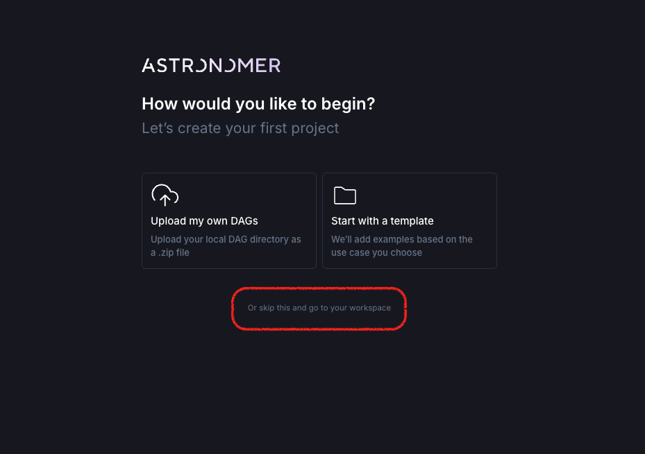
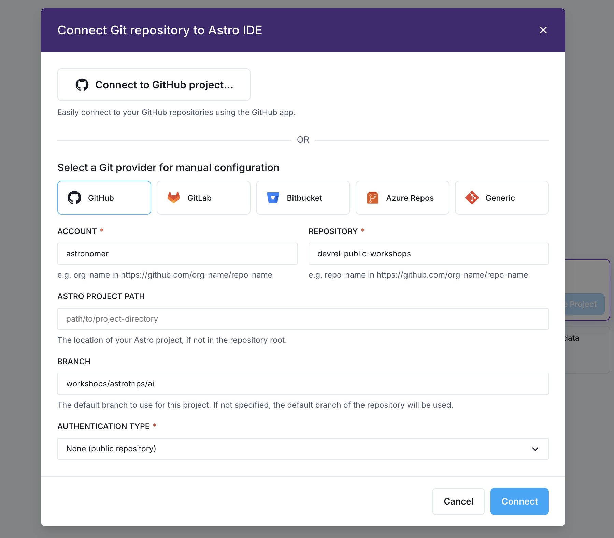
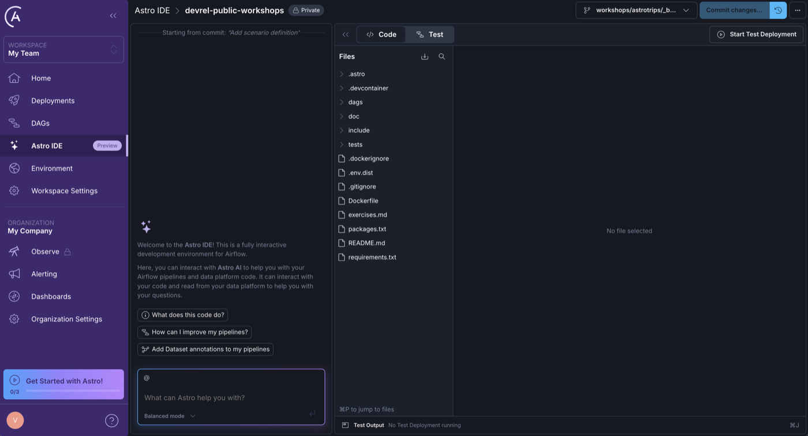
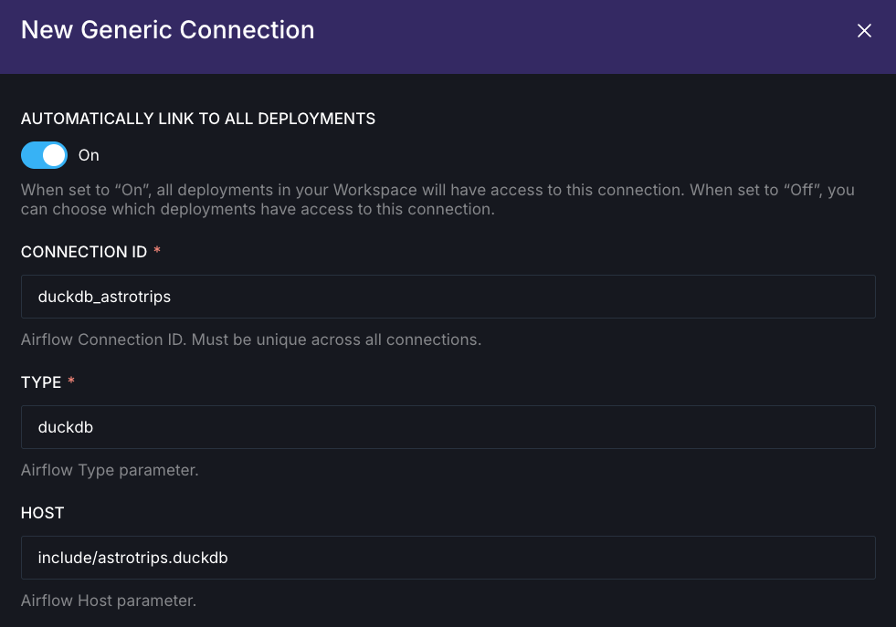
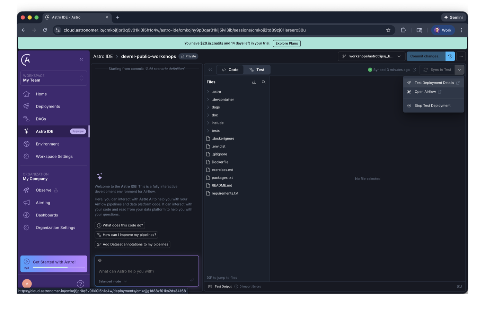
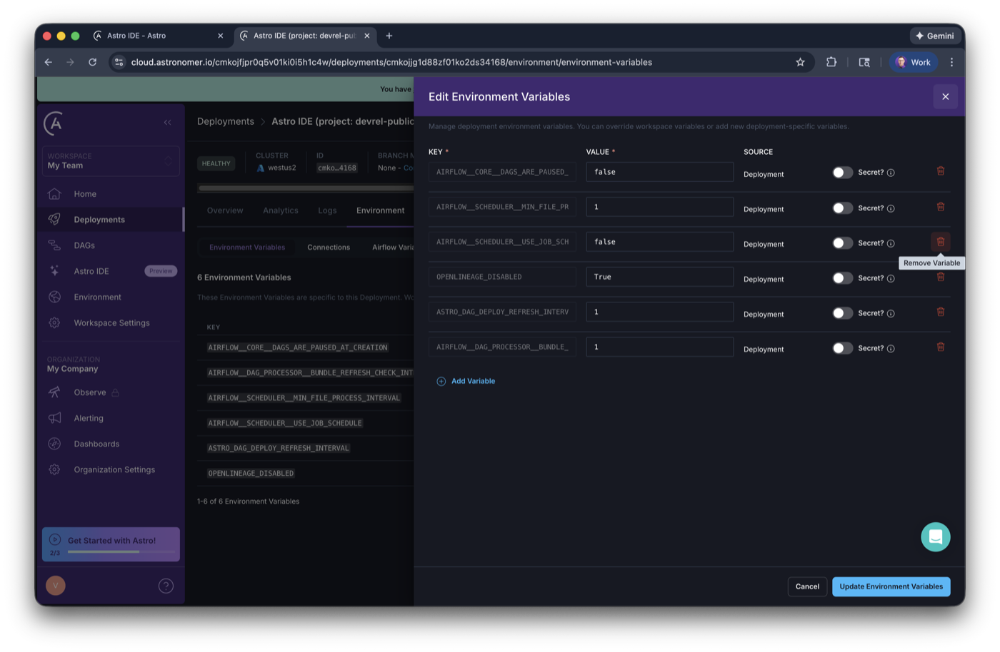
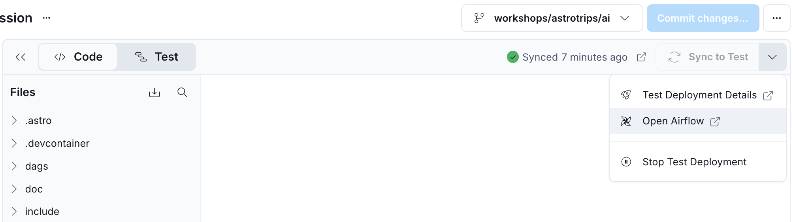
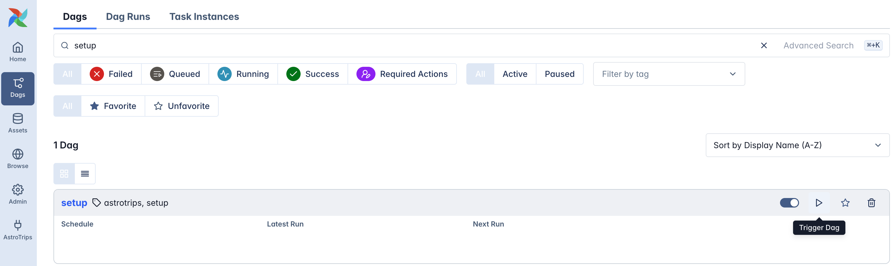

# Airflow ELT Workshop

## Exercises

- [Exercise 0: Astro and Astro IDE](#exercise-0-astro-and-astro-ide)
- [Exercise 1: Build the daily report Dag](#exercise-1-build-the-daily-report-dag)
- [Challenge: Mission control](#challenge-mission-control)
- [Exercise 2: Asset-aware scheduling](#exercise-2-asset-aware-scheduling)
- [Exercise 3: ELT and dynamic task mapping](#exercise-3-elt-and-dynamic-task-mapping)
- [Exercise 4: Human-in-the-loop](#exercise-4-human-in-the-loop)

---

# Exercise 0: Astro and Astro IDE

## Set Up Astro IDE

This workshop does not require any local Airflow installation. Instead, all development takes place within Astro and the Astro IDE. The first step is to set up a **free** Astro trial to run Airflow and access the Astro IDE for Dag development.

While a deep understanding of the Astro platform is not required, here is a quick overview: Each customer has a dedicated Organization on Astro. An Organization can contain multiple Workspaces (for example, one per team). Each Workspace can have multiple Deployments, where a Deployment is a fully hosted Airflow environment.

1. Create a [free trial of Astro](https://www.astronomer.io/lp/signup/?utm_source=conference&utm_medium=web&utm_campaign=devrel-workshop).

    - After creating an account, verifying your email, and logging in, choose _Personal_ in the first step.
    - Next, choose an _Organization_ and _Workspace_ name. These can be fictional names and you can change them later.
    - In the third step, click the small link at the bottom under the two boxes: _Or skip this and go to your workspace_.

    

    - You should now see the Astro platform UI.

2. Open the _Astro IDE_ from the left navigation and select _Connect Git project..._
3. Under _Select a Git provider for manual configuration_, select _GitHub_ and enter the following details:

    - **ACCOUNT**: `astronomer`
    - **REPOSITORY**: `devrel-public-workshops`
    - _Keep Astro Project Path empty_
    - **BRANCH**: `workshops/astrotrips/<workshop>` (for example: `workshops/astrotrips/etl`)
    - **AUTHENTICATION TYPE**: `None (public repository)`
    - Click _Connect_. The IDE will import and open the project for you.

    

**You now have the Astro IDE with the project ready to go.**



## Set Up the Connection

This workshop relies on a DuckDB database. To ensure your test environments can connect to it, the next step is to create a workspace-wide connection.

1. In Astro, navigate to _Environment_ → _Connections_ and click the _+ Connection_ button.
2. In the dialog, select _Generic_ and enter the following details:

    - Set **AUTOMATICALLY LINK TO ALL DEPLOYMENTS** to _On_
    - **CONNECTION ID**: `duckdb_astrotrips`
    - **TYPE**: `duckdb`
    - **HOST**: `include/astrotrips.duckdb`

    

3. Click _Create Connection_.

> [!TIP]
> Learn more about [Airflow connections](https://www.astronomer.io/docs/learn/connections).

## Start the Test Deployment and Run the Setup Dag

The final setup step is to start a test deployment (a fully functional Airflow environment) and run the `setup` Dag, which creates the DuckDB database with tables and sample data for the following exercises.

1. Navigate to the _Astro IDE_ and click _Start Test Deployment_ in the top right corner.
2. While the deployment is starting, click the dropdown next to _Sync to Test_ and select _Test Deployment Details_.

    

3. Navigate to the _Environment_ tab and click _Edit Deployment Variables_.
4. In the popup, remove the `AIRFLOW__SCHEDULER__USE_JOB_SCHEDULE` variable to enable cron scheduling for the test deployment.

5. Click _Update Environment Variables_.

    

6. Back in the Astro IDE, from the same dropdown menu, select _Open Airflow_.

    

7. In the Airflow UI, open the Dags view from the left menu and trigger the `setup` Dag using the play button.

    

**Once the Dag run completes successfully, your database is ready.**

> [!IMPORTANT]
> Running this Dag resets and re-creates the database. If you encounter any issues in the following exercises, simply run this Dag again.

---

# Exercise 1: Build the daily report Dag

In this exercise, you will create a Dag that ingests new booking data, generates a daily report, and validates the output. The validated report is then published as an **asset**, making it available to downstream consumers.

**What you will learn:**

- Running parameterized SQL queries with `SQLExecuteQueryOperator`.
- Validating data with `SQLColumnCheckOperator`.
- Publishing an asset to signal data availability.

## Create the Dag file

1. In the Astro IDE, create a new file `dags/daily_report.py`.
2. Add the following imports and connection constant:

    ```python
    from airflow.configuration import AIRFLOW_HOME
    from airflow.providers.common.sql.operators.sql import SQLExecuteQueryOperator, SQLColumnCheckOperator
    from airflow.sdk import dag, chain, Asset
    from pendulum import datetime

    _DUCKDB_CONN_ID = "duckdb_astrotrips"
    ```

3. Define the Dag using the `@dag` decorator:

    ```python
    @dag(
        schedule="@daily",
        start_date=datetime(2026, 1, 1),
        tags=["astrotrips", "reporting"],
        template_searchpath=f"{AIRFLOW_HOME}/include/sql"
    )
    def daily_report():
        pass

    daily_report()
    ```

    The `template_searchpath` parameter tells Airflow where to find SQL files referenced by name.

> [!TIP]
> Learn more about [Airflow decorators and the TaskFlow API](https://www.astronomer.io/docs/learn/airflow-decorators).

## Add the ingest task

The first task simulates ingesting new booking data by calling a SQL script that generates random bookings.

1. Inside the `daily_report()` function, add:

    ```python
    _ingest_data = SQLExecuteQueryOperator(
        task_id="ingest",
        conn_id=_DUCKDB_CONN_ID,
        sql="generate.sql",
        params={ "n_bookings": 5 }
    )
    ```

    The `params` dictionary passes variables to the SQL template. Open `include/sql/generate.sql` to see how `{{ params.n_bookings }}` is used.

> [!NOTE]
> **`parameters` vs `params`**
>
> These two attributes serve different purposes:
>
> - **`parameters`** uses database-level parameter binding. The placeholder syntax depends on your database driver (e.g., `$reportDate` for DuckDB, `%(name)s` for Postgres). This is the preferred and secure approach since the database driver handles escaping, preventing SQL injection. You can still use Jinja templating for the values themselves, when instantiating the operator.
>
> - **`params`** uses Jinja templating before the query reaches the database driver. It treats your SQL as a plain string and replaces `{{ params.name }}` placeholders. This is useful when the SQL structure itself needs to be dynamic, like repeating query fragments multiple times.
>
> Learn more about parameters vs params [in this video](https://www.youtube.com/watch?v=QNAzQgvcQGM). It also demonstrates the risk of SQL injection.

> [!NOTE]
> **How `SQLExecuteQueryOperator` works under the hood**
>
> The `SQLExecuteQueryOperator` is a generic operator for running SQL workloads from Airflow. It relies on the [`DbApiHook`](https://airflow.apache.org/docs/apache-airflow-providers-common-sql/stable/_api/airflow/providers/common/sql/hooks/sql/index.html) abstract base class, which is designed to work with Python's [DB-API 2.0 (PEP 249)](https://peps.python.org/pep-0249/) specification, the standard interface for database access in Python.
>
> Each database provider (Postgres, Snowflake, DuckDB, etc.) ships its own hook that inherits from `DbApiHook` and wraps the native database driver. As long as the provider package is installed and implements a proper `DbApiHook` subclass, you can use this operator with any compliant database.

> [!TIP]
> Learn more about [executing SQL with Airflow](hhttps://www.astronomer.io/docs/learn/airflow-sql).

## Add the report generation task

The second task aggregates booking data into a daily report per planet.

1. Open `include/sql/report.sql` and review the query. Notice that it expects a `$reportDate` parameter and uses an upsert pattern (`ON CONFLICT ... DO UPDATE`) to handle re-runs gracefully.
2. The query is missing the `total_paid_usd` column. Find the `-- TODO` comment in the SQL file and add the missing aggregation following the pattern of the other columns.
3. Create a `SQLExecuteQueryOperator` with task_id `generate_report` that:
    - Uses the `report.sql` file
    - Passes the logical date formatted as `YYYY-MM-DD` as a parameter named `reportDate`

    Unlike the previous task which used `params` for Jinja templating, this task needs to use `parameters` to pass values directly to the database driver (for DuckDB's `$variable` syntax).

> [!TIP]
> You need to find the right Airflow template variable for the formatted logical date. See the [templates reference](https://airflow.apache.org/docs/apache-airflow/stable/templates-ref.html).

## Add data validation

Before publishing the report, validate that the data meets quality expectations.

1. Add a `SQLColumnCheckOperator` task:

    ```python
    _validate_report = SQLColumnCheckOperator(
        task_id="validate_report",
        conn_id=_DUCKDB_CONN_ID,
        table="daily_planet_report",
        column_mapping={
            "planet_name": {
                "null_check":     {"equal_to": 0},
                "distinct_check": {"geq_to": 3},
            },
            "total_passengers": {
                "null_check":     {"equal_to": 0},
                "min":            {"geq_to": 1},
            }
        },
        outlets=Asset("daily_report")
    )
    ```

    The `outlets` parameter declares that this task produces the `daily_report` asset. Downstream Dags can subscribe to this asset to trigger automatically when new data is available.

> [!TIP]
> Learn more about [data quality checks](https://www.astronomer.io/docs/learn/airflow-sql-data-quality) and [assets](https://www.astronomer.io/docs/learn/airflow-datasets).

## Wire up the tasks

Use `chain()` to define the execution order.

1. At the end of the `daily_report()` function, add:

    ```python
    chain(
        _ingest_data,
        _generate_report,
        _validate_report
    )
    ```

## Test your Dag

1. In the Astro IDE, click _Sync to Test_ to deploy your changes.
2. Open the Airflow UI and trigger the `daily_report` Dag.
3. Verify all tasks complete successfully.
4. Check the _assets_ view in Airflow to confirm the `daily_report` asset was updated.

## See data validation in action

To understand how data quality checks protect your pipeline, let's intentionally trigger a failure.

1. In your `_validate_report` task, change the `distinct_check` threshold from `3` to `42`:

    ```python
    "distinct_check": {"geq_to": 42},
    ```

2. Sync and trigger the Dag again.
3. Observe that the `validate_report` task fails. Open the task logs to see the validation error message.
4. Notice that the `daily_report` asset was **not** updated this time, the quality gate prevented bad data from being published.
5. Change the threshold back to `3`, sync, and run the Dag once more to confirm it passes.

---

# Challenge: Mission control

It is time for a challenge.

The workshop provides a custom `MissionControlOperator`, which generates an interstellar clearance code based on your implementation. Only if you finished all tasks successfully until here, including using the correct task IDs and dependencies, the code will be correct.

1. Add the following import to your `daily_report.py` implementation:

    ```py
    from include.mission_control import MissionControlOperator
    ```

2. Create an instance of the operator within your `@dag` function, and assign the task ID `mission_control`:

    ```py
    _mission_control = MissionControlOperator(task_id="mission_control")
    ```

3. Add the task as a last step in your Dag:

    ```py
    chain(
        _ingest_data,
        _generate_report,
        _validate_report,
        _mission_control
    )
    ```

4. Sync your changes, trigger your `daily_report` Dag, and check the task logs so see the clearance code.
5. Post the code into the chat, so the workshop host can validate it.

The first 3 that finish this challenge successfully receive a gift from Astronomer!

---

# Exercise 2: Asset-aware scheduling

In this exercise, you will create a second Dag that is triggered automatically when the `daily_report` asset is updated. Since the `SQLColumnCheckOperator` updates the `daily_report` asset, it means every time data has been checked, the asset is updated and the second Dag will be triggered. This pattern decouples data producers from consumers.

**What you will learn:**

- Scheduling a Dag based on Asset updates.
- Pulling data from upstream tasks via XCom.

## Create the Dag file

1. In the Astro IDE, create a new file `dags/publish_report.py`.
2. Add the following imports:

    ```python
    from airflow.providers.common.sql.operators.sql import SQLExecuteQueryOperator
    from airflow.sdk import dag, task, chain, Asset

    _DUCKDB_CONN_ID = "duckdb_astrotrips"
    ```

3. Define the Dag with asset-aware scheduling:

    ```python
    @dag(
        schedule=Asset("daily_report"),
        tags=["astrotrips", "reporting"]
    )
    def publish_report():
        pass

    publish_report()
    ```

    By passing an `Asset` to the `schedule` parameter, this Dag will trigger whenever the `daily_report` Asset is updated by the upstream Dag.

> [!TIP]
> Learn more about [Asset-aware scheduling](https://www.astronomer.io/docs/learn/airflow-datasets).

## Add the query task

Fetch the latest report data from the database.

1. Inside the `publish_report()` function, add:

    ```python
    _get_report = SQLExecuteQueryOperator(
        task_id="get_report",
        conn_id=_DUCKDB_CONN_ID,
        sql="SELECT * FROM daily_planet_report WHERE report_date = (SELECT MAX(report_date) FROM daily_planet_report)"
    )
    ```

    Since this Dag is triggered by an asset, there is no logical date. Which means, we can't use `{{ ds }}`. Instead, the query fetches the most recent report.

## Add a Python task

Create a task that formats and prints the report. In a real scenario, this could send an email, update a dashboard, or call an external API.

1. Add the following `@task`-decorated function inside the Dag:

    ```python
    @task
    def print_report(ti=None):
        from include.utils import print_report_row

        rows = ti.xcom_pull(task_ids="get_report") or []

        print("::group::Daily Planet Report")
        print("Planet | Passengers | Active | Done | Gross USD | Discount | Net USD")
        print("-" * 65)

        for row in rows:
            print_report_row(row)

        print("::endgroup::")
    ```

    The `ti.xcom_pull()` method retrieves the query results from the upstream task. XCom (cross-communication) is Airflow's mechanism for passing data between tasks.

> [!TIP]
> Learn more about [passing data between tasks](https://www.astronomer.io/docs/learn/airflow-passing-data-between-tasks).

## Wire up the tasks

1. At the end of the `publish_report()` function, add:

    ```python
    chain(
        _get_report,
        print_report()
    )
    ```

## Test the Asset-triggered Dag

1. Sync your changes to the test deployment.
2. In the Airflow UI, navigate to the _Dags_ view.
3. Trigger the `daily_report` Dag from Exercise 1.
4. Once `daily_report` completes, observe that `publish_report` is triggered automatically.
5. Open the `publish_report` Dag run and check the logs of the `print_report` task to see the formatted output.

---

# Exercise 3: ELT and dynamic task mapping

In this exercise, you will build an ingest pipeline that fetches weather data from an external API for all planets. You'll use **dynamic task mapping** to parallelize the API calls at runtime.

> [!NOTE]
> This is an Extract-Load (EL) pipeline, not full ELT. We extract from the API and load into the database. A true ELT would add a transform step *after* loading to create derived tables.

**What you will learn:**

- Writing a Python `@task` to load data from an API.
- Using `.expand()` to dynamically create tasks at runtime.
- Collecting results from mapped tasks for downstream processing.

## Create the Dag file

1. Create `dags/weather_ingest.py` with the following structure:

    ```python
    from airflow.providers.common.sql.operators.sql import SQLExecuteQueryOperator, SQLInsertRowsOperator
    from airflow.sdk import chain, dag, task

    _DUCKDB_CONN_ID = "duckdb_astrotrips"


    @dag(
        schedule="@daily",
        tags=["astrotrips", "ingest"],
    )
    def weather_ingest():
        pass


    weather_ingest()
    ```

## Add the extract tasks

1. Add a `SQLExecuteQueryOperator` to get all planet IDs, then a task to extract them:

    ```python
    _get_planets = SQLExecuteQueryOperator(
        task_id="get_planets",
        conn_id=_DUCKDB_CONN_ID,
        sql="SELECT DISTINCT planet_id FROM planets",
    )

    @task
    def extract_planet_ids(query_result):
        """Extract planet IDs from query result rows."""
        return [row[0] for row in query_result]
    ```

2. Add a task to fetch weather for a single planet. This task will be dynamically mapped:

    ```python
    @task
    def fetch_weather(planet_id: int, logical_date=None):
        from include.weather_api import get_planet_weather
        return get_planet_weather(planet_id, logical_date.date())
    ```

    The `logical_date` parameter is automatically injected by Airflow.

## Add the load task

We will use a `SQLInsertRowsOperator` to insert the rows into a `planet_weather` table. However, this operator expects tuples.

1. Add the following task to transform the weather data:

```python
@task
def prepare_rows(weather_data: list[dict]):
    """Transform weather dicts to tuples for SQLInsertRowsOperator."""
    return [
        (w["planet_id"], w["reading_date"], w["temperature_c"], w["storm_risk"], w["visibility"])
        for w in weather_data
    ]
```

2. Then add the `SQLInsertRowsOperator` with a `preoperator` to make it idempotent:

```python
_insert_rows = SQLInsertRowsOperator(
    task_id="load_weather",
    conn_id=_DUCKDB_CONN_ID,
    table_name="planet_weather",
    columns=["planet_id", "reading_date", "temperature_c", "storm_risk", "visibility"],
    rows=rows,
    preoperator="DELETE FROM planet_weather WHERE reading_date = '{{ ds }}';",
)
```

> [!NOTE]
> The `preoperator` deletes existing records for the current date before inserting, ensuring idempotent re-runs. The `planet_weather` table must already exist (created by the `setup` Dag).

## Wire up with dynamic task mapping

1. At the end of your Dag function, connect the tasks using `.expand()`:

```python
planet_ids = extract_planet_ids(_get_planets.output)
weather_data = fetch_weather.expand(planet_id=planet_ids)
rows = prepare_rows(weather_data)

chain(rows, _insert_rows)
```

The `.expand(planet_id=planet_ids)` creates one `fetch_weather` task instance per planet. When `prepare_rows` receives `weather_data`, Airflow automatically collects all outputs from the mapped tasks into a list.

> [!TIP]
> Learn more about [dynamic task mapping](https://www.astronomer.io/docs/learn/dynamic-tasks).

## Test your Dag

1. Sync and trigger the `weather_ingest` Dag.
2. In the Graph view, observe the `fetch_weather` task shows brackets `[ ]` indicating it's mapped.
3. Click on `fetch_weather` to see individual mapped task instances.
4. Verify the `planet_weather` table was created with weather data.

---

# Exercise 4: Human-in-the-loop

In this exercise, you will build a Dag that pauses for human input using a human-in-the-loop operator. The workflow lets an operator update a planet-to-planet route's base fare.

**What you will learn:**

- Using `HITLEntryOperator` to collect user input mid-workflow.
- Passing HITL output to downstream tasks.

## Create the Dag file

1. Create `dags/update_fare.py` with the following structure:

    ```python
    from airflow.providers.common.sql.operators.sql import SQLExecuteQueryOperator
    from airflow.providers.standard.operators.hitl import HITLEntryOperator
    from airflow.sdk import dag, task, chain, Param

    _DUCKDB_CONN_ID = "duckdb_astrotrips"


    @dag(tags=["astrotrips", "hitl"])
    def update_fare():
        pass


    update_fare()
    ```

> [!NOTE]
> This Dag is meant to run manually, so it has no `schedule`. Since Airflow 3, the default value for `schedule` is `None`, so we do not need to set it explicitly.

## Add an operator to fetch current fares

1. Add a `SQLExecuteQueryOperator` to fetch the current route fares:

```python
_get_fares = SQLExecuteQueryOperator(
    task_id="get_current_fares",
    conn_id=_DUCKDB_CONN_ID,
    sql="""
        SELECT r.route_id, p.planet_name, r.base_fare_usd
        FROM routes r
        JOIN planets p ON p.planet_id = r.destination_id
        ORDER BY r.route_id
    """,
)
```

2. Add a task to format the results for display in the HITL body:

```python
@task
def format_fares(rows):
    """Format fare rows for display in HITL body."""
    return "\n".join([f"Route {r[0]}: {r[1]} - ${r[2]}" for r in rows])
```

## Add the HITL input task

The `HITLEntryOperator` pauses the Dag and waits for human input via the Airflow UI.

1. Add the following task to the Dag:

```python
_hitl_input = HITLEntryOperator(
    task_id="input_new_fare",
    subject="Update route base fare",
    body="Current fares:\n\n{{ ti.xcom_pull(task_ids='format_fares') }}",
    params={
        "route_id": Param(1, type="integer", description="Route ID to update"),
        "new_fare": Param(1000, type="integer", description="New base fare in USD"),
    },
)
```

> [!NOTE]
> The `body` uses Jinja templating to display formatted fares. The `params` define form fields for user input.

## Add tasks to apply and display the update

1. First, add a task to extract the parameters from the HITL output:

```python
@task
def build_update_params(hitl_output):
    """Extract params from HITL output for the UPDATE query."""
    return {
        "new_fare": hitl_output["params_input"]["new_fare"],
        "route_id": hitl_output["params_input"]["route_id"],
    }
```

2. Then add a `SQLExecuteQueryOperator` for the `UPDATE` query, passing the params via `parameters`:

```python
_apply_update = SQLExecuteQueryOperator(
    task_id="apply_fare_update",
    conn_id=_DUCKDB_CONN_ID,
    sql="UPDATE routes SET base_fare_usd = $new_fare WHERE route_id = $route_id",
    parameters=_update_params,
)
```

3. Add another task to fetch the updated fares:

```python
_get_updated_fares = SQLExecuteQueryOperator(
    task_id="get_updated_fares",
    conn_id=_DUCKDB_CONN_ID,
    sql="""
        SELECT r.route_id, p.planet_name, r.base_fare_usd
        FROM routes r
        JOIN planets p ON p.planet_id = r.destination_id
        ORDER BY r.route_id
    """,
)
```

4. Add a task to display the results:

```python
@task
def print_updated_fares(rows):
    """Print the updated fares to logs."""
    print("::group::Updated Route Fares")
    print("Route ID | Destination | Base Fare")
    print("-" * 40)
    for row in rows:
        print(f"{row[0]:8} | {row[1]:11} | ${row[2]}")
    print("::endgroup::")
```

## Wire up the tasks

1. Finally, wire up all tasks by defining the dependencies:

```python
_formatted_fares = format_fares(_get_fares.output)
_update_params = build_update_params(_hitl_input.output)

chain(
    _formatted_fares,
    _hitl_input,
    _update_params,
    _apply_update,
    _get_updated_fares,
    print_updated_fares(_get_updated_fares.output)
)
```

> [!NOTE]
> Note how `_hitl_input.output` passes the HITL response to `build_update_params`, and `.output` is used to pass query results to tasks.

## Test the HITL workflow

1. Sync and trigger the `update_fare` Dag.
2. The Dag pauses at `input_new_fare`. Click on the task and open the **Required Actions** tab.
3. Enter a route ID and new fare, then click **Submit**.
4. The Dag continues. Check the `print_updated_fares` task logs to see the updated fares.

> [!TIP]
> Learn more about [human-in-the-loop workflows](https://www.astronomer.io/docs/learn/airflow-human-in-the-loop).

---

Congratulations! You've reached the end of the workshop. We recommend checking out the linked resources and continuing to extend your project during your Astro trial.
