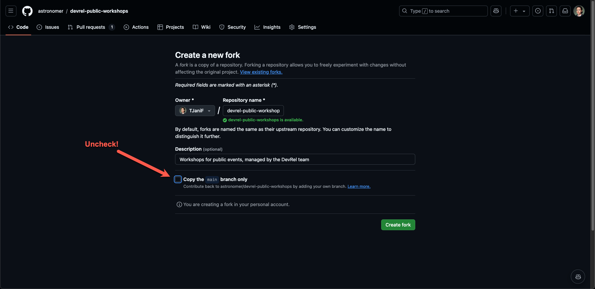
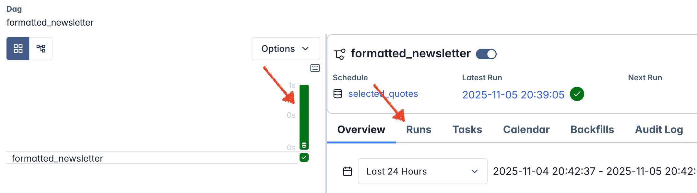
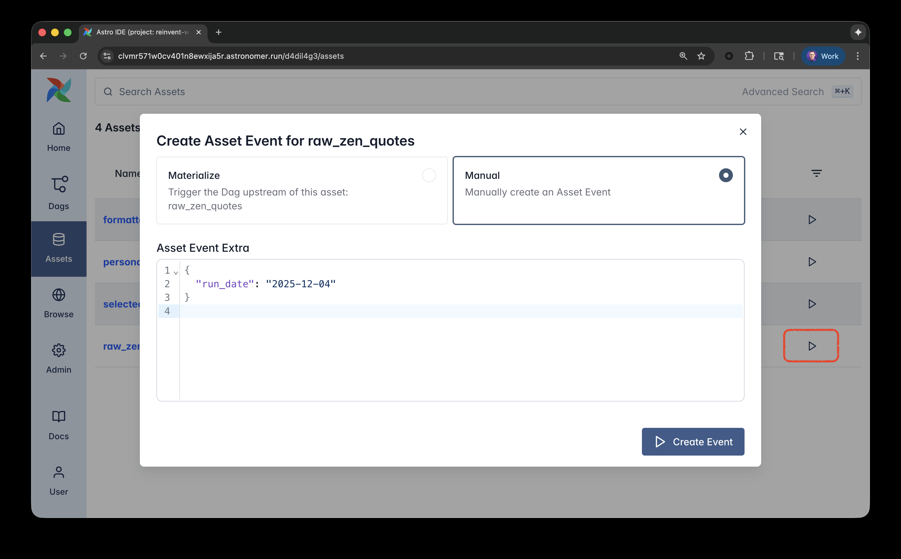

> [!IMPORTANT]
> Ensure to read through the [README.md](README.md) before starting with the modules.

Have fun 🍻!

# Module 0: Astro and Astro IDE

The final preparation step is to setup a **free** trial of Astro to run Airflow and the Astro IDE to write Dags. It is not necessary to understand all details of the Astro platform, but in a nutshell: Each customer has a dedicated Organization on Astro. One Organization can have multiple Workspaces (e.g. per team). A Workspace is a collection of Deployments. Each Workspace can have multiple Deployments. A Deployment is an Airflow environment hosted on Astro.

1. Create a [free trial of Astro](https://www.astronomer.io/lp/signup/?utm_source=conference&utm_medium=web&utm_campaign=reinvent-25).
   - After creating an account and logging in, choose `Start a Free Astro Trial` (click link Create Organization)
   - When being asked how you want to use Astro, choose Personal
   - Choose an Organization name and a Workspace name
   - When asked to select a template, click `None`. Leave all other settings and click `Create Deployment in Astro`. Note that you will not need this Deployment for this workshop, but you can use it for the remaining duration of your trial.
   - You should now see the UI of the Astro platform. Leave it for now, we'll come back to it in a few steps.
2. Install the free [Astro CLI](https://www.astronomer.io/docs/astro/cli/install-cli).
3. [Fork this repository](https://github.com/astronomer/devrel-public-workshops/fork). Make sure you uncheck the `Copy the main branch only` option when forking.

   

4. Clone your fork. Get the URL by clicking on Code -> Copy to clipboard. Then run `git clone <url>`.
5. Run `git checkout airflow-3-reinvent` to switch to the airflow 3 branch.
6. Ensure you are authenticated to your Astro trial by running `astro login` in your terminal. It will prompt you to go to your browser to sign in.
7. Export your project to the Astro IDE by running `astro ide project export` in your terminal. Choose `y` to create a new project, and give your project a name when prompted. Your new Astro IDE project should automatically open in a browser.
8. To start Airflow, click the `Start test deployment` button. This will create a small Airflow Deployment for you to run your dags. It may take a few minutes to spin up.
9. To enable scheduled dag runs in your new Airflow Deployment, click on the drop down next to `Sync to test`, and click `Test Deployment Details`.

   

   - Go to the `Environment` tab, click `Edit Deployment Variables`, and delete the `AIRFLOW__SCHEDULER__USE_JOB_SCHEDULE` variable.

   

10. Go back to the Astro IDE, and in the drop down next to `Sync to Test`, click on `Open Airflow`.

> [!NOTE]
> Environment ready! Proceed to the modules to start exploring Airflow.

# Module 1: Explore the Airflow UI and assets

Airflow 3 has a completely refreshed UI that is React-based and easier to navigate. In this exercise, you'll explore the new interface and understand the relationship between Dags and Assets.

## 1. Explore the home page

1. Once you have started Airflow, navigate to the **Home** page
2. Initially, there won't be much content, but this will change as you progress through the exercises

## 2. Navigate Dags and assets

1. Explore the **Dags** view to see the available workflows

> [!IMPORTANT]
> You will see 4 Dags in this view, all of them already activated. Compare those to the architecture diagram to get a better understanding of the functionality.

2. Check the schedule column and identify which Dag is triggered time-based, and which Dags are triggered asset-aware
3. Open the **Assets** view to understand data dependencies

> [!IMPORTANT]
> You will see 4 assets in this view. These are updated via the Dags you saw before.

4. Click on the `raw_zen_quotes` to open the asset graph, and explore how the Dags and assets are connected

## 3. Run Dags

1. **Run** the `raw_zen_quotes` Dag
2. Observe how all Dags are being triggered via their asset dependencies
3. Once all Dags finished successfully, open each Dag one by one, and open the recent run by clicking the bar in the grid view on the left or by clicking the latest run in the Runs tab

   

4. Within the Dag runs, click on the tasks to see the logs
5. Specifically, check the task logs for the `create_personalized_newsletter` task in the `personalize_newsletter` Dag, it should show the generated newsletter

## 4. Explore UI features

Try out these new UI features:

1. **Switch themes**: Toggle between light mode and dark mode 😎
2. **Change language**: Try a different language from the `User` menu
3. **Navigation**: Notice how easy it is to navigate between different views

## 5. (Bonus) Trigger via asset events

Let us assume the `raw_zen_quotes` Dag takes a long time to finish, and we don't want to wait for it. In this case, we can also generate asset update events in the Airflow UI, without running the underlying function (materializing).

1. Navigate to the Assets view in the UI, click on the play button next to the `raw_zen_quotes` asset
2. Select Manual and add the following extra JSON:

   ```json
   {
      "run_date": "2025-12-04"
   }
   ```
   This is used in our implementation to determine for which day the newsletter is generated, and is also part of the final newsletter file name. Click on Create Event.

   

3. Go back to the Dags view and see how the Dags are running, without `raw_zen_quotes` being executed. You will see 2 runs for each Dag except `raw_zen_quotes`.

# Module 2: Add human-in-the-loop

Airflow 3.1 introduced human-in-the-loop (HITL) operators, allowing manual intervention in automated workflows. In this exercise, you'll add an approval step for newsletter personalization.

1. In the **Astro IDE** code editor, open the `personalize_newsletter.py` file
2. Add the import at the top of the file:

   ```python
   from airflow.providers.standard.operators.hitl import ApprovalOperator
   ```

3. Add this operator to your Dag after the `create_personalized_newsletter` task:

   ```python
   approve_personalization = ApprovalOperator(
      task_id="approve_personalization",
      subject="Your task:",
      body="{{ ti.xcom_pull(task_ids='create_personalized_newsletter') }}",
      defaults="Approve", # other option: "Reject"
   )
   ```

4. Modify the task dependencies to include the approval step:

   ```python
   create_personalized_newsletter.expand(user=_get_weather_info) >> approve_personalization
   ```
   Make sure the approval task comes after `create_personalized_newsletter` in your workflow.

5. Save the file
6. Click `Sync to Test` in the upper right corner and wait for the sync to complete

_Switch back to the Airflow UI._

7. Run the `raw_zen_quotes` Dag again to trigger an end-to-end run
8. The workflow will pause at the approval step
9. Navigate to **Browse** → **Required Actions** in the Airflow UI

   The **Required Actions** view provides:
      - Instance-wide view of all pending approvals
      - Easy access to review content
      - Batch approval capabilities for multiple items

10. Open the pending action, review the newsletter content, and either **Approve** or **Reject** the results
11. Try to change the `body` of your `ApprovalOperator`. Change it to a multi-line-string and add Markdown as it will be rendered in the Airflow UI.

# Module 3: Use Dag versioning

Dag versioning is a new feature in Airflow 3 that tracks changes to your Dag code over time. In this exercise, you'll explore how versioning works and compare different versions of your Dags.

1. Navigate to the **Dags** view in the Airflow UI
2. Click on the `personalize_newsletter` Dag
3. Go to the **Graph** view
4. Click on **Options** in the top menu
5. Notice the **Dag Version** dropdown
6. Check how many versions are available in the dropdown, you should see multiple versions from the changes made in the previous module

> [!NOTE]
> 💡 Why do you have multiple versions? Each time you modified the Dag structure (adding the HITL operator), Airflow created a new version to track these changes. But only, if a Dag run is between the changes.

7. Toggle between different versions using the dropdown
8. Observe the changes in the **Graph** view:
   - **Version 1**: Original Dag structure
   - **Version 2**: After adding the HITL operator
9. Navigate to the **Code** tab
10. Use the version dropdown to toggle between different versions, and observe the code differences

# Module 4: GenAI, event-driven scheduling, and some sci-fi

This module demonstrates a more realistic version of the newsletter pipeline using Amazon Bedrock for GenAI personalization and SQS for event-driven scheduling.

We will also spice up the newsletter by using the user's favorite sci-fi character.

## Prerequisites

> [!IMPORTANT]
> This exercise requires an AWS account with access to SQS and Amazon Bedrock

You'll need:
- AWS account with appropriate permissions
- Access to Amazon Bedrock (may require model access requests)
- SQS queue creation permissions

## 1. Update the Dag code

1. Navigate to `dags/personalize_newsletter.py`
2. Replace the entire contents with the code from `solutions/personalize_newsletter_genai.py`

## 2. Configure environment variables

1. Copy the contents of `.env_example` to `.env`
2. Update the `AIRFLOW_CONN_AWS_DEFAULT` with your AWS credentials:

   ```bash
   AIRFLOW_CONN_AWS_DEFAULT=aws://YOUR_ACCESS_KEY:YOUR_SECRET_KEY@/?region_name=us-east-1
   ```

> [!IMPORTANT]
> Add the `.env` file to `.gitignore` to avoid pushing credentials to GitHub

## 3. Create SQS queue

1. Log into your AWS Console
2. Navigate to **Amazon SQS**
3. Create a new queue (standard queue is sufficient)
4. Copy the queue URL
5. Add the URL to your `.env` file:

   ```bash
   SQS_QUEUE_URL=https://sqs.us-east-1.amazonaws.com/123456789012/your-queue-name
   ```

## 4. Configure bedrock access

1. In AWS Console, navigate to **Amazon Bedrock**
2. Go to **Model access** in the left sidebar
3. Request access to a model (e.g., Claude or Titan models)
4. Wait for approval (this may take a few minutes)

## 5. Restart Airflow

Restart your Airflow test deployment to load the new environment variables

## 6. Test event-driven scheduling

1. Navigate to your SQS queue in the AWS Console
2. Send a message with this JSON format:

   ```json
   {
   "id": 300,
   "name": "Your Name",
   "location": "Your City",
   "motivation": "Your motivational theme",
   "favorite_sci_fi_character": "Your favorite character"
   }
   ```

3. The `personalize_newsletter` Dag should automatically start running
4. Monitor the Dag execution in the Airflow UI

## 7. Review Results

1. Check the Dag execution logs
2. Review your personalized newsletter in the `include/newsletters` folder
3. Notice how the GenAI integration creates more sophisticated personalization

## 8. (Bonus) Adjust the Prompt

Notice how the prompt in the code uses the user's favorite sci‑fi character? Have some fun—adjust the prompt and see how unique a newsletter you can create.

> [!IMPORTANT]
> Module complete! You've now experienced the full power of Airflow 3's new features.
