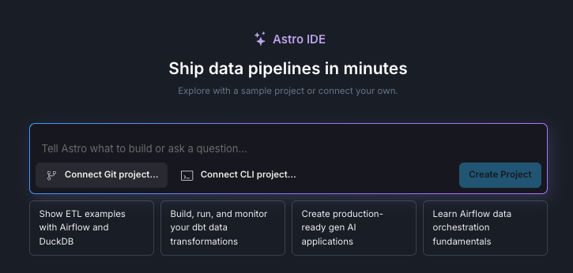
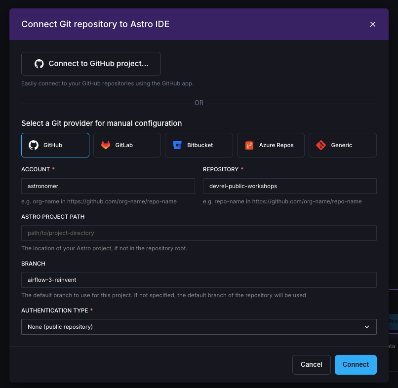
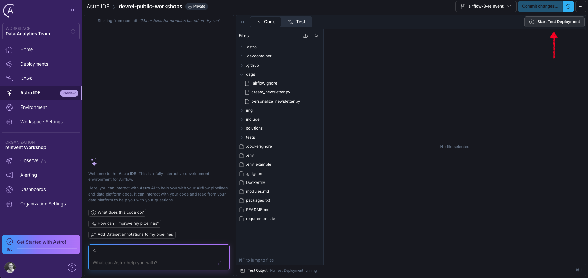
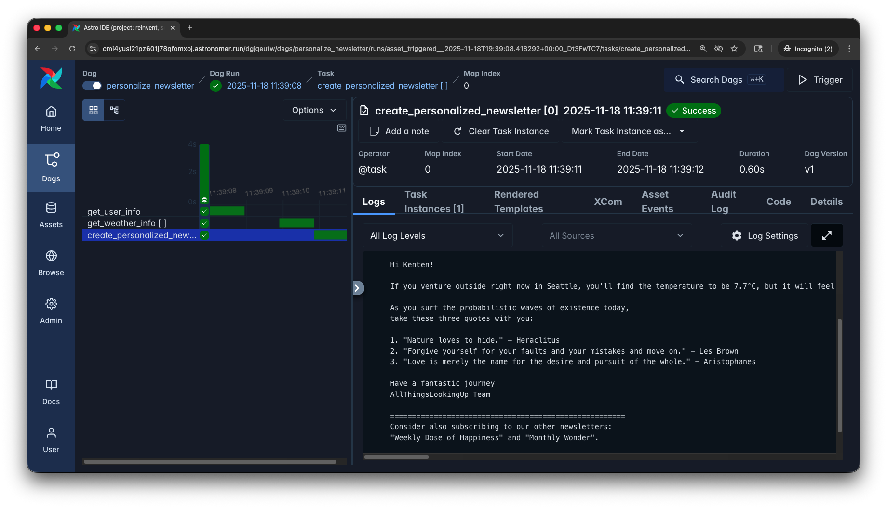
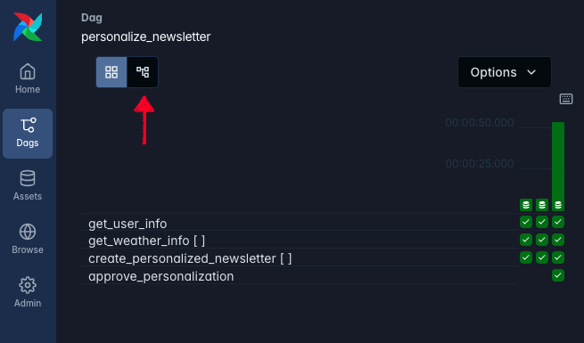

> [!IMPORTANT]
> Ensure to read through the [README.md](README.md) before starting with the modules.

Have fun 🍻!

# Module 0: Astro and Astro IDE

The final preparation step is to setup a **free** trial of Astro to run Airflow and the Astro IDE to write Dags. It is not necessary to understand all details of the Astro platform, but in a nutshell: Each customer has a dedicated Organization on Astro. One Organization can have multiple Workspaces (e.g. per team). Each Workspace can have multiple Deployments. A Deployment is an Airflow environment hosted on Astro.

1. Create a [free trial of Astro](https://www.astronomer.io/lp/signup/?utm_source=conference&utm_medium=web&utm_campaign=reinvent-25).

   - After creating an account, verifying your email and logging in, choose _Personal_ in the first step.
   - Then, choose an _Organization_ and _Workspace_ name in the second step. Can be fictional names and you will be able to change them later.
   - In the third step, click the small link at the bottom under the two boxes, saying _Or skip this and go to your workspace_.

   

   - You should now see the UI of the Astro platform.

2. Open the _Astro IDE_ from the navigation on the left, and select _Connect Git project..._

   

3. Under _Select a Git provider for manual configuration_ select _GitHub_ and enter the following details:

   - **ACCOUNT**: `astronomer`
   - **REPOSITORY**: `devrel-public-workshops`
   - _Keep Astro Project Path empty_
   - **BRANCH**: `airflow-3-reinvent`
   - **AUTHENTICATION TYPE**: `None (public repository)`
   - Click on _Connect_, the IDE will import and open the project for you

   

4. To start Airflow, click the _Start Test Deployment_ button. This will create a small Airflow Deployment for you to run your dags. It may take a few minutes to spin up.

   

5. To enable scheduled dag runs in your new Airflow Deployment, click on the drop down next to _Sync to test_, and click _Test Deployment Details_.

   

   - Go to the `Environment` tab, click `Edit Deployment Variables`, and delete the `AIRFLOW__SCHEDULER__USE_JOB_SCHEDULE` variable.

   

6. Go back to the Astro IDE. Do this, by switching back to the first browser tab. **Avoid opening the Astro IDE via the navigation, as that would start a new IDE session**! Then, in the drop down next to _Sync to Test_, click on _Open Airflow_.

> [!NOTE]
> Environment ready! Proceed to the modules to start exploring Airflow.

# Module 1: Explore the Airflow UI and assets

Airflow 3 has a completely refreshed UI that is React-based and easier to navigate. In this exercise, you'll explore the new interface and understand the relationship between Dags and Assets.

## 1. Explore the home page

1. Once you have started Airflow, navigate to the **Home** page
2. Initially, there won't be much content, but this will change as you progress through the exercises

## 2. Navigate Dags and assets

1. Explore the **Dags** view to see the available workflows

> [!IMPORTANT]
> You will see 4 Dags in this view, all of them already activated. Compare those to the architecture diagram to get a better understanding of the functionality.

2. Check the schedule column and identify which Dag is triggered time-based, and which Dags are triggered asset-aware
3. Open the **Assets** view via the main navigation

> [!IMPORTANT]
> You will see 4 assets in this view. These are updated via the Dags you saw before.

4. Click on the `raw_zen_quotes` to open the asset graph, and explore how the Dags and assets are connected

## 3. Run Dags

1. **Run** the `raw_zen_quotes` DAG from the _Dags view_ by clicking the _play_ button next to it. Keep the default options and click _Trigger_.
2. Observe how all Dags are being triggered via their asset dependencies
3. Once all Dags finished successfully, open each Dag one by one, and open the recent run by clicking the bar in the grid view on the left or by clicking the latest run in the Runs tab

   

4. Within the Dag runs, click on the tasks to see the logs
5. Specifically, check the task logs for the `create_personalized_newsletter` task in the `personalize_newsletter` Dag, it should show the generated newsletter

   

## 4. Explore UI features

Try out these new UI features:

1. **Switch themes**: Toggle between light mode and dark mode from the _User_ menu 😎
2. **Change language**: Try a different language, also from the _User_ menu
3. **Navigation**: Notice how easy it is to navigate between different views

## 5. (Bonus) Trigger via asset events

Let us assume the `raw_zen_quotes` Dag takes a long time to finish, and we don't want to wait for it. In this case, we can also generate asset update events in the Airflow UI, without running the underlying function (materializing).

1. Navigate to the Assets view in the UI, click on the play button next to the `raw_zen_quotes` asset
2. Select Manual and add the following extra JSON:

   ```json
   {
      "run_date": "2025-12-04"
   }
   ```
   This is used in our implementation to determine for which day the newsletter is generated, and is also part of the final newsletter file name. Click on Create Event.

   

3. Go back to the Dags view and see how the Dags are running, without `raw_zen_quotes` being executed. You will see 2 runs for each Dag except `raw_zen_quotes`.

# Module 2: Add human-in-the-loop

Airflow 3.1 introduced human-in-the-loop (HITL) operators, allowing manual intervention in automated workflows. In this exercise, you'll add an approval step for newsletter personalization.

1. In the **Astro IDE** code editor, open the `personalize_newsletter.py` file
2. Add the import at the top of the file:

   ```python
   from airflow.providers.standard.operators.hitl import ApprovalOperator
   ```

3. Add this operator to your Dag after the `create_personalized_newsletter` task:

   ```python
   approve_personalization = ApprovalOperator(
      task_id="approve_personalization",
      subject="Your task:",
      body="{{ ti.xcom_pull(task_ids='create_personalized_newsletter') }}",
      defaults="Approve", # other option: "Reject"
   )
   ```

4. Modify the task dependencies to include the approval step:

   ```python
   create_personalized_newsletter.expand(user=_get_weather_info) >> approve_personalization
   ```
   Make sure the approval task comes after `create_personalized_newsletter` in your workflow.

5. Save the file
6. Click `Sync to Test` in the upper right corner and wait for the sync to complete

_Switch back to the Airflow UI._

7. Run the `raw_zen_quotes` Dag again to trigger an end-to-end run
8. The workflow will pause at the approval step
9. Navigate to **Browse** → **Required Actions** in the Airflow UI

   The **Required Actions** view provides:
      - Instance-wide view of all pending approvals
      - Easy access to review content
      - Batch approval capabilities for multiple items

10. Open the pending action, review the newsletter content, and either **Approve** or **Reject** the results
11. Try to change the `body` of your `ApprovalOperator`. Change it to a multi-line-string and add Markdown as it will be rendered in the Airflow UI.

# Module 3: Use Dag versioning

Dag versioning is a new feature in Airflow 3 that tracks changes to your Dag code over time. In this exercise, you'll explore how versioning works and compare different versions of your Dags.

1. Navigate to the **Dags** view in the Airflow UI
2. Click on the `personalize_newsletter` Dag
3. Go to the **Graph** view

   

4. Click on **Options** in the top menu
5. Notice the **Dag Version** dropdown
6. Check how many versions are available in the dropdown, you should see multiple versions from the changes made in the previous module

> [!NOTE]
> 💡 Why do you have multiple versions? Each time you modified the Dag structure (adding the HITL operator), Airflow created a new version to track these changes. But only, if a Dag run is between the changes.

7. Toggle between different versions using the dropdown
8. Observe the changes in the **Graph** view:
   - **Version 1**: Original Dag structure
   - **Version 2**: After adding the HITL operator
9. Navigate to the **Code** tab
10. Use the version dropdown to toggle between different versions, and observe the code differences

# Module 4: GenAI, event-driven scheduling, and some sci-fi

This module demonstrates a more realistic version of the newsletter pipeline using Amazon Bedrock for GenAI personalization and SQS for event-driven scheduling.

We will also spice up the newsletter by using the user's favorite sci-fi character.

## Prerequisites

> [!IMPORTANT]
> This exercise requires an AWS account with access to SQS and Amazon Bedrock

You'll need:
- AWS account with appropriate permissions
- Access to Amazon Bedrock
- SQS queue creation permissions

## 1. Connect to AWS

In order to interact with AWS, we first need to set up an [Airflow connection](https://www.astronomer.io/docs/learn/connections). Although you can configure these through the Airflow UI or Astro workspace settings, we will use environment variables for this specific workshop.

Since Airflow automatically looks for environment variables starting with `AIRFLOW_CONN` to use them for connections, we can use this method to easily pass credentials. We will also add a second variable for the SQS queue URL. To apply these, we will update our test deployment settings in the Astro frontend.

1. In the Astro IDE, click on the drop down next to `Sync to test`, and click `Test Deployment Details`.

   

2. Go to the _Environment_ tab, click _Edit Deployment Variables_, and add the following two environment variables by clicking on _Add Variable_. Simply replace the values with your details and paste them into the corresponding input fields. Hint: you don't need to change the value format, you can paste it directly into the value field.

   - **Key**: `AIRFLOW_CONN_AWS_DEFAULT`, **value**:
   ```
   {
      "conn_type": "aws",
      "login": "<your_aws_access_key_id>",
      "password": "<your_aws_secret_access_key>",
      "extra": {
         "region_name": "<your_aws_region>"
      }
   }
   ```

   - **Key**: `SQS_QUEUE_URL`, **value**:
   ```
   <your_sqs_queue_url>
   ```

## 2. Update the Dag code

1. Navigate to `dags/personalize_newsletter.py`
2. Replace the entire contents with the code from `solutions/personalize_newsletter_genai.py`
3. Click on _Sync to test_ and wait for completion

## 3. Test event-driven scheduling

Before running the personalization pipeline, we need to ensure today's newsletter is created, since it serves as the base for personalization. Let's first trigger the full process without event-driven scheduling. This will create the newsletter and personalize it for all users defined in `include/user_data`.

1. Open Airflow and trigger the `raw_zen_quotes` Dag in the Dags view, and wait until all Dags finished successfully (incl. `personalize_newsletter_genai`).

Now it is time for event-driven scheduling, to trigger the personalization for a specific user.

2. Navigate to your SQS queue in the AWS Console
3. Send a message with this JSON format (adjust the values):

   ```json
   {
      "id": 300,
      "name": "Your Name",
      "location": "Your City",
      "motivation": "Your motivational theme",
      "favorite_sci_fi_character": "Your favorite character"
   }
   ```

4. The `personalize_newsletter_genai` Dag should automatically start running (the poll interval is set to 5 seconds)
5. Monitor the Dag execution in the Airflow UI

## 4. Review Results

Review your personalized newsletter in the log output of the `create_personalized_newsletter` task in the `personalize_newsletter_genai` Dag.

## 5. (Bonus) Adjust the Prompt

Notice how the prompt in the code uses the user's favorite sci‑fi character? Have some fun, adjust the prompt and see how unique a newsletter you can create.

> [!IMPORTANT]
> Module complete! You've now experienced the full power of Airflow 3's new features.
